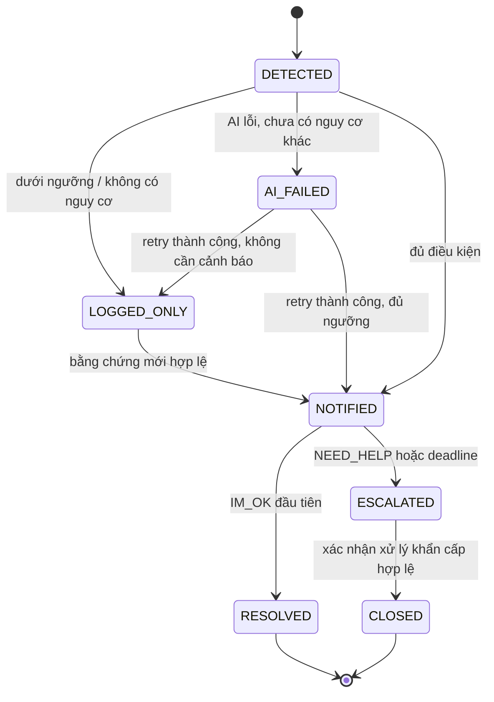

# Plan US-13 — Escalation state machine theo loại sự kiện

> Phần giao với US-11, US-14, US-15, shared outbox và confirmation tuân theo [kế hoạch tích hợp 5 thành viên](PLAN_AGILE_5_MEMBER_EXECUTION.md).
> Trạng thái: kế hoạch thực thi, chưa triển khai.
> Mục tiêu: đánh giá ngưỡng, thông báo, xác nhận, leo thang và phục hồi sau restart mà không mất cảnh báo đang chờ.

## 1. Phạm vi và nguồn chuẩn

- Sở hữu chuyển events.status, deadline, confirmations, event_status_history và durable notification intents.
- Nhận tập kết quả từ [US-11](PLAN_US-11_EVENT_AI_LABELS.md); gọi kênh qua interface, [US-14](PLAN_US-14_TELEGRAM_ALERTS.md) triển khai Telegram.
- Cung cấp đường xác nhận từ dashboard và kênh ngoài. Không xây toàn bộ UI quản trị rule US-15 hoặc provider Connect/SNS trong story này.
- Nguồn: [OpenAPI](../api/openapi.yaml), [schema](../db/migrations/0001_init.sql), [rule seed](../db/migrations/0002_seed_escalation_rules.sql), [DATA_FLOW](architecture/DATA_FLOW.md), [coding convention](conventions/CODING_CONVENTION.md), [Git workflow](conventions/GIT_WORKFLOW.md).
- Khi bắt đầu, đọc AGENTS.md nếu có và git status, tái sử dụng module đã có, giữ thay đổi ngoài phạm vi.

## 2. Hiện trạng và điểm mâu thuẫn cần giải quyết

| Thành phần           | Hiện trạng                                            | Kế hoạch                                                     |
| -------------------- | ----------------------------------------------------- | ------------------------------------------------------------ |
| events               | Đã có mọi status và các cột timestamp/deadline        | Tái sử dụng, không tạo enum trùng                            |
| escalation_rules     | Đã có T_low/T_high/T_wait, priority, channels         | Snapshot rule cho mỗi đợt đánh giá                           |
| confirmations        | Một authoritative confirmation/event qua unique index | Giữ cho quyết định ban đầu; thêm phase cho xác nhận khẩn cấp |
| event_status_history | Đã có actor/reason/channel/metadata                   | Mọi transition ghi trong cùng transaction                    |
| Backend              | Chưa có escalation/notifications module               | Tạo engine + deadline worker + outbox                        |
| Dashboard            | confirmOk/confirmHelp hiện xử lý state UI cục bộ      | Nối API thật, không báo thành công trước response            |

### Quyết định thiết kế của plan

1. User story yêu cầu recovery theo detected_at. Tài liệu DATA_FLOW hiện dùng now()+T_wait. Thực hiện `deadline = detected_at + effectiveWaitSeconds` ngay lần thông báo đầu, lưu DB và dùng lại sau restart. Cập nhật tài liệu cũ trong PR để thống nhất; không chỉ đổi công thức lúc recovery.
2. OpenAPI ghi `confidence >= T_high` vẫn NOTIFIED nhưng hẹn giờ ngắn, trong khi US-15 chỉ cho quản trị viên cấu hình một `T_wait`. Để không mở rộng contract ngoài user story, thời gian chờ cho nhánh confidence cao được suy ra bằng `max(1, ceil(T_wait / 2))` giây. Công thức này phải nằm trong policy dùng chung và hiển thị dạng chỉ đọc trên trang Cấu hình. FIRE/WELLNESS ngoại lệ dùng T_wait riêng theo rule.
3. “Xác nhận đầu tiên” áp dụng quyết định IM_OK/NEED_HELP giai đoạn NOTIFIED. Sau NEED_HELP vẫn phải cho một xác nhận khẩn cấp riêng để đóng ESCALATED; không để unique index hiện tại chặn CLOSED mãi mãi.
4. P1/P3 trong persona không phải event priority. UNKNOWN_PERSON mặc định P2 theo seed; không đổi priority thành P1 chỉ vì người nhận là persona P1.

## 3. Policy đánh giá ngưỡng

Đọc rule theo event_type; rule có is_enabled=false không tạo hành động mới. Rule snapshot gồm version/hash, priority, thresholds, wait, channels và max level.

| Điều kiện                                    | Quyết định                                             |
| -------------------------------------------- | ------------------------------------------------------ |
| PERSON_DETECTED, không có label nguy cơ      | LOGGED_ONLY                                            |
| M1 KNOWN/UNDETERMINED không kèm nguy cơ khác | LOGGED_ONLY, không gửi M1 alarm                        |
| Lỗi AI đơn thuần trước khi phản ứng          | AI_FAILED, không coi là confidence=0                   |
| Nguy cơ hợp lệ, confidence < T_low           | LOGGED_ONLY                                            |
| T_low <= confidence < T_high                 | NOTIFIED, wait=T_wait                                  |
| confidence >= T_high                         | NOTIFIED, wait=max(1, ceil(T_wait/2))                  |
| Rule skip_logged_only=true                   | NOTIFIED theo T_wait của rule; không skip quality gate |
| T_low/T_high null cho WELLNESS               | Đánh giá rule scheduler hợp lệ, không ép null thành 0  |
| Nguy cơ cần confidence nhưng nhận null/sai   | Ghi lỗi, không tự phát cảnh báo hoặc so sánh null      |

- T_low<=T_high; 0<=T_wait<=3600, validate ở API/service/DB phù hợp. Nhánh confidence cao dùng công thức suy ra, không thêm trường cấu hình thứ tư.
- FIRE_SMOKE_DETECTED dùng P0, skip_logged_only=true, T_wait=30 theo rule hiện có; “bất kể confidence” không biến lỗi model thành phát hiện cháy.
- PERSON_DETECTED có channels rỗng, T_wait=0 không được tự escalate.
- Rules hiện có: FALL P1/60s, RESTRICTED_ZONE P1/60s, UNKNOWN_PERSON P2/120s, WELLNESS P2/300s, FIRE P0/30s.
- Rule mới có hiệu lực với lần đánh giá mới; không reset deadline của event đang chờ do admin thay T_wait.

### Nhiều nhãn trong một event

1. Đánh giá mỗi candidate hợp lệ bằng rule và confidence của chính candidate đó.
2. Có ít nhất một candidate đủ notify thì event được NOTIFIED, dù nhãn đại diện có priority cao hơn nhưng score dưới T_low.
3. Event priority giữ mức nghiêm trọng cao nhất theo US-11; lưu `triggeringResults` để biết nhãn nào thực sự kích hoạt phản ứng.
4. Nếu nhiều candidate kích hoạt: dùng deadline sớm nhất, hợp nhất channels, không tạo notification trùng cùng recipient/channel/transition.
5. Nhãn nghiêm trọng mới đến khi đang NOTIFIED có thể rút ngắn deadline, không kéo dài; ghi lịch sử policy update. Nếu cần thông báo mức nguy hiểm tăng, tạo action riêng có dedup theo aggregateVersion.
6. KNOWN/UNDETERMINED của M1 không hủy cảnh báo M4/M3; lỗi M1 không xóa deadline của nguy cơ khác.

## 4. State machine



- Không cho Telegram sender hoặc MQTT UPDATE status trực tiếp.
- Không downgrade NOTIFIED/ESCALATED khi result AI score thấp đến sau.
- RESOLVED/CLOSED là terminal trong story; replay AI/MQTT không mở lại.
- LOGGED_ONLY chỉ được nâng khi có observation/revision mới hợp lệ, không reevaluate vô hạn cùng payload.
- ESCALATED chưa phải CLOSED chỉ vì cuộc gọi đã được gửi hoặc provider báo delivered; phải có xác nhận đã tiếp nhận xử lý từ actor được phép.

## 5. Deadline và recovery

### Khi chuyển NOTIFIED

Trong cùng transaction:

1. Lock event và kiểm tra version/status.
2. Ghi status=NOTIFIED, notified_at=DB now.
3. Tính `escalation_deadline_at = detected_at + effectiveWaitSeconds` từ snapshot rule đã chọn.
4. Ghi history kèm reason, triggeringResults, rule snapshot và deadline basis.
5. Insert notification intents/outbox.
6. Commit trước khi gọi Telegram/provider.

Ví dụ detected_at=10:00:00, T_wait=120s → deadline 10:02:00. AI xong 10:00:05 vẫn còn 115s; restart 10:01:30 còn 30s, không được cộng lại 120s.

Nếu deadline đã qua khi inference hoàn tất, ghi NOTIFIED rồi xử lý due ngay qua transaction tiếp theo. Không cấp thêm T_wait từ now để che độ trễ. Worker có thể bỏ notification caregiver cũ nếu emergency escalation đã thay thế; history vẫn phản ánh đầy đủ.

### Worker phục hồi

- Quét DB khi startup và định kỳ theo ESCALATION_POLL_INTERVAL_MS; DB là nguồn chuẩn, setTimeout chỉ được dùng như tối ưu phụ.
- Query NOTIFIED có deadline<=now, theo priority rank rồi deadline, LIMIT cấu hình; dùng FOR UPDATE SKIP LOCKED hoặc conditional UPDATE tương đương.
- Nhiều instance chỉ một worker thắng transition cho cùng event.
- Recovery dùng deadline đã lưu. Record legacy thiếu deadline phải backfill từ detected_at và rule snapshot; nếu chưa có snapshot, dùng rule hiện tại kèm audit `LEGACY_DEADLINE_BACKFILL`, không giả biết rule cũ.
- Transaction ESCALATED tạo history và emergency outbox atomically; crash sau commit trước gửi được outbox phục hồi.
- Đánh giá timeout theo DB clock UTC. Timezone camera chỉ dùng hiển thị; phát hiện detected_at bất hợp lý quá xa tương lai/clock skew phải log và xử lý input trước khi lập lịch.

## 6. Xác nhận đồng thời và phase khẩn cấp

### Giai đoạn INITIAL

Giữ API `POST /events/{eventId}/confirm` với IM_OK/NEED_HELP:

- JWT với dashboard; adapter Telegram truyền actor đã xác minh qua internal service.
- Kiểm tra role và quyền theo camera/owner, không chỉ role CAREGIVER chung.
- Lock event; nếu NOTIFIED và chưa có authoritative INITIAL: insert confirmation, đổi state, ghi history, hủy deadline/đánh dấu timer hết hiệu lực và enqueue side effects trong cùng transaction.
- IM_OK → RESOLVED/resolved_at; NEED_HELP → ESCALATED/escalated_at và emergency intents ngay.
- Lần bấm sau ghi is_authoritative=false, trả 409 ALREADY_CONFIRMED; transaction ghi audit phải commit trước khi controller trả lỗi, tránh rollback mất lần bấm sau.
- Retransmission cùng sourceUpdateId không tạo thêm bản ghi click. Click mới thật sự mới ghi thêm audit.

### Race với deadline

- Nếu confirmation transaction thắng trước timeout transition, timer thấy status đổi và không escalate lần nữa.
- Nếu timer đã chuyển ESCALATED trước, nút INITIAL cũ trả đã xử lý/không còn hiệu lực, không chuyển ngược về RESOLVED.
- Dùng thời điểm và thứ tự commit trên DB làm chuẩn; timestamp do client gửi không có quyền đảo kết quả.

### Giai đoạn EMERGENCY

- Migration thêm confirmation phase INITIAL/EMERGENCY; backfill record cũ INITIAL.
- Thay unique authoritative index thành `(event_id, phase) WHERE is_authoritative` hoặc bảng emergency acknowledgements riêng. Chọn một cách, không triển khai cả hai.
- Xác nhận emergency dùng ACKNOWLEDGED, actor user hoặc emergency contact đã xác minh và liên kết notification/call attempt hợp lệ.
- Khi ESCALATED và có acknowledgement hợp lệ: CLOSED, closed_at, history/handler metadata; giữ nguyên INITIAL NEED_HELP đã ghi trước đó.
- Bổ sung API riêng `POST /events/{eventId}/close` cho caregiver/admin được phép hoặc adapter provider nội bộ gọi cùng service. Contract nêu rõ ACKNOWLEDGED và điều kiện có emergency attempt; callback không được dùng contactId tùy ý.
- Webhook Connect đã có trong OpenAPI là điểm tích hợp; adapter thật thuộc US-27. Mock chứng minh state machine, nhưng nghiệm thu “đã gọi liên hệ” cần channel adapter thật và test recipient được chỉ định.

## 7. Outbox, emergency dispatch và lịch sử

- notifications/outbox được ghi bền vững trước side effect; idempotency theo event, transition, level, recipient và channel.
- Engine không đợi network trong DB transaction và không đợi Telegram retry xong mới bắt đầu timer.
- Đọc emergency_contacts theo priority_order, tối đa max_escalation_level hiện có (1–3). Sender/provider adapter trả kết quả/ack qua interface.
- Lịch thử liên hệ tiếp theo cần timeout cấu hình riêng và trạng thái attempt bền vững; không dùng T_wait ban đầu để đoán thời gian cuộc gọi.
- Hết danh sách hoặc provider chưa cấu hình: giữ ESCALATED, ghi failure và hiển thị cần xử lý; không tự CLOSED, không báo đã gọi thành công.
- Event RESOLVED/CLOSED thì worker hủy/skip các action chưa gửi không còn phù hợp. External call đã phát đi không thể hứa thu hồi; acknowledgement đến muộn vẫn phải dedup.
- Lịch sử lưu from/to, reason, actor, channel, rule version và timestamps. SYSTEM cho timeout, USER cho confirm, không gán actor user giả cho worker.
- Thay đổi deadline khi có nguy cơ cao hơn ghi audit riêng, không giả tạo status transition nếu status chưa đổi.

## 8. Contract và migration

### OpenAPI

- Implement `/events/{eventId}/confirm` theo contract hiện có; thêm 401/403/400 nếu thiếu.
- Implement endpoint close mới và mô tả emergency phase; response Confirmation thêm phase nếu dùng chung schema.
- Giữ rule schemas/read/update với đúng `tLow`, `tHigh`, `tWaitSeconds`; API response có thể trả `effectiveHighWaitSeconds` dạng computed/read-only để UI giải thích hành vi, không lưu thêm cột.
- Event detail expose history, deadlines, handler, rule/triggering result summary cần thiết; không public nội dung token/provider secret.
- Các internal callback dùng internal token, webhook dùng guard riêng; không để @Public mà thiếu auth thay thế.
- Chạy api:lint/contracts:generate trước triển khai consumer; không viết tay API types trong web.

### Database

- Tái sử dụng cột status/timestamps/partial index deadline đang có.
- Migration mới thêm rule snapshot/decision version, confirmation phase/index, unique action identity và lease/outbox nếu cần; không thêm cột short wait ngoài phạm vi US-15.
- Nếu US-11 đã tạo aggregate_version/outbox, dùng chung thay vì thêm bản trùng.
- events/confirmation/history/outbox cùng transaction; mọi query danh sách có LIMIT và SQL tham số hóa.
- Không sửa migration 0001/0002; cập nhật ERD, DATA_FLOW và ví dụ comment đang dùng now()+T_wait để phản ánh quyết định detected_at.

## 9. Cấu trúc code và tích hợp dashboard

```text
apps/orchestrator/src/escalation/
  escalation.module.ts
  escalation-policy.ts
  escalation-engine.service.ts
  escalation.repository.ts
  escalation-deadline-worker.service.ts
  escalation-rules.repository.ts
  confirmation.service.ts
  emergency-dispatch.interface.ts
  dto/
```

- Policy thuần trả decision; application service chịu transaction, repository chỉ SQL/mapping.
- Gắn confirm/close controller vào module events hoặc escalation, không khai báo hai route trùng.
- events-client.ts thêm confirm/close qua apiFetch; useEvents.ts bỏ optimistic mutation giả của confirmOk/confirmHelp, dùng response canonical và SSE event.updated.
- UI pending disable button; 409 hiển thị “Sự kiện đã được xử lý” và reload. Lỗi network không hiển thị đã xác nhận.
- Hiển thị người/giờ xác nhận từ server, nullable deadline và trạng thái CLOSED/RESOLVED rõ ràng; CSS Modules/token hiện tại, tiếng Việt và responsive 360px.
- Countdown frontend chỉ để hiển thị; không trigger escalation bằng đồng hồ browser.

## 10. Cấu hình và quan sát

- ConfigService cho poll interval, batch size, lease timeout, provider attempt timeout và emergency contact wait; thêm .env.example, không magic numbers trong logic.
- Log correlationId/eventId/transitionId, previousStatus/newStatus/reason, deadline, latenessMs, ruleVersion và actor ID phù hợp.
- Metrics: số pending/due, escalation trễ, outbox backlog, notification failure, conflict confirmation, recovery count.
- CloudWatch nhận structured stdout qua cấu hình hạ tầng khi deploy AWS; test log ingest thực tế trước khi báo đã có CloudWatch.
- Không log bot/internal secret, số điện thoại đầy đủ hoặc raw image/embedding.

## 11. Ma trận kiểm thử bắt buộc

| Given/When                                               | Then                                                     |
| -------------------------------------------------------- | -------------------------------------------------------- |
| confidence < T_low                                       | LOGGED_ONLY, không notification                          |
| confidence = T_low hoặc giữa hai ngưỡng                  | NOTIFIED, deadline detected_at+T_wait                    |
| confidence = T_high hoặc cao hơn                         | NOTIFIED với `max(1, ceil(T_wait/2))`                    |
| FIRE hợp lệ score thấp                                   | NOTIFIED P0, deadline 30s theo rule                      |
| PERSON_DETECTED hoặc UNDETERMINED đơn thuần              | Không alarm                                              |
| UNKNOWN cùng M4, confidence khác nhau                    | Mỗi candidate dùng đúng rule; không bỏ nguy cơ đủ ngưỡng |
| IM_OK ở NOTIFIED                                         | RESOLVED, timer vô hiệu, history/actor đầy đủ            |
| NEED_HELP ở NOTIFIED                                     | ESCALATED và emergency action ngay                       |
| Deadline hết, không phản hồi                             | Một ESCALATED transition                                 |
| Hai worker hoặc hai confirm cùng lúc                     | Một quyết định thắng, không trùng action                 |
| Timer thắng trước button INITIAL                         | Không đảo ESCALATED về RESOLVED                          |
| NEED_HELP rồi emergency ACK                              | CLOSED được dù INITIAL đã authoritative                  |
| CLOSED hoặc RESOLVED nhận AI/callback cũ                 | Không mở lại                                             |
| Restart lúc NOTIFIED, deadline còn 30s                   | Vẫn chỉ còn 30s                                          |
| Restart sau deadline hoặc crash sau commit               | Escalate ngay một lần, outbox phục hồi                   |
| Telegram lỗi hết retries                                 | Deadline giữ nguyên, engine vẫn escalate                 |
| Admin sửa rule trong lúc chờ                             | Không tự kéo dài/reset deadline cũ                       |
| Rule missing/disabled, confidence null, future timestamp | Lỗi/policy rõ, không coercion hoặc silent success        |

Unit fake clock cho policy và exact boundaries; integration PostgreSQL cho locks/unique/transactions/race; restart test kill worker thực rồi chạy lại. Không chỉ test in-memory timer. Core logic coverage tối thiểu 60%, phủ đầy đủ các transition được phép và bị cấm.

## 12. Trình tự triển khai và Git

1. Contract + migration: detected_at basis, công thức high-confidence wait và confirmation phases.
2. Policy thuần + test; shared engine interfaces chốt với US-11/14.
3. Transaction transitions/history/outbox.
4. Deadline worker/recovery/multi-instance.
5. Confirm/close API và emergency dispatch interface.
6. Nối dashboard API thật, SSE và chạy tích hợp Telegram khi US-14 sẵn sàng.
7. E2E: tạo event → NOTIFIED → restart → deadline → ESCALATED → acknowledgement test → CLOSED. Chạy riêng nhánh IM_OK và NEED_HELP.
8. Nhánh ví dụ `feat/US-13-escalation-state-machine`; chia PR nhỏ, contract merge trước consumer. Commit mẫu `feat(orchestrator): phục hồi deadline leo thang từ database`.
9. Chạy `pnpm api:lint`, `pnpm contracts:generate`, `pnpm --filter @cam/orchestrator test`, `pnpm --filter @cam/web test`, `pnpm check:all` và Docker health checks.
10. PR đúng template, evidence restart/concurrency/Telegram failure; API cần A/B review, một người khác approve; không tự merge, squash theo Git workflow.

## 13. Definition of Done

- [ ] Ngưỡng thấp/trung/cao, FIRE và nullable score có policy được test.
- [ ] Mọi transition qua engine và ghi history atomically.
- [ ] Deadline tính từ detected_at, lưu DB, recovery không cấp lại thời gian chờ.
- [ ] IM_OK/NEED_HELP lần đầu có hiệu lực xuyên kênh, race với timer an toàn.
- [ ] Emergency ACK riêng đóng được ESCALATED sau NEED_HELP.
- [ ] Notification failure/restart không làm mất pending escalation.
- [ ] Outbox, multi-instance, stale callbacks và terminal states được test.
- [ ] Dashboard dùng confirm API thật, không chỉ cập nhật local state.
- [ ] Các adapter chưa có được ghi rõ; không coi mock call là gọi khẩn cấp thành công.
- [ ] Contract, migration/ERD, DATA_FLOW, env/runbook và required checks hoàn tất.
