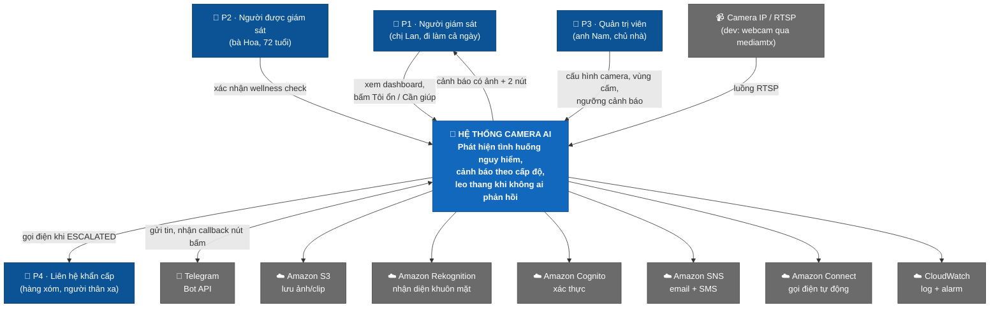
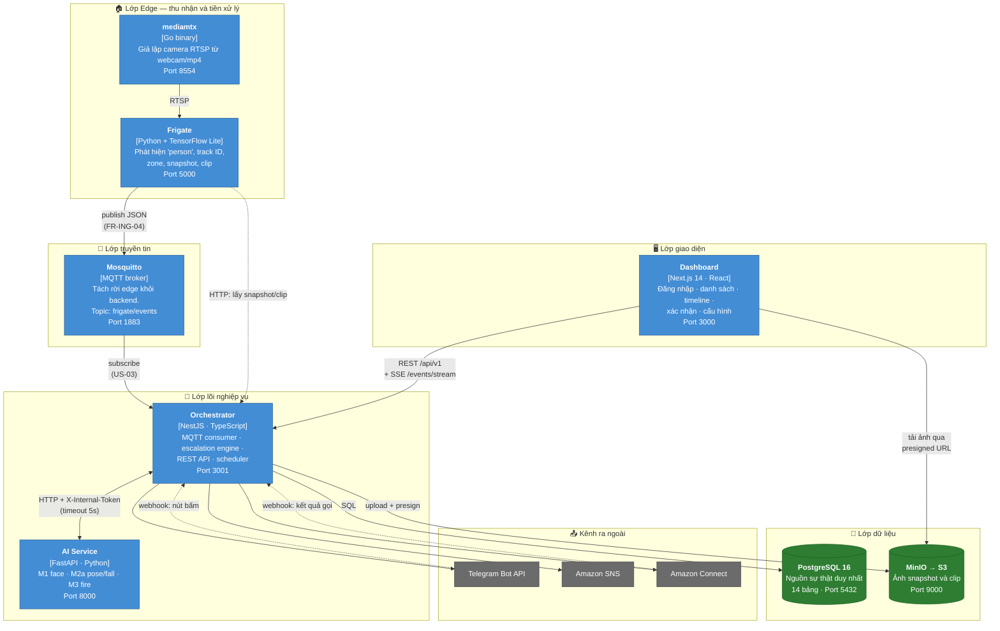
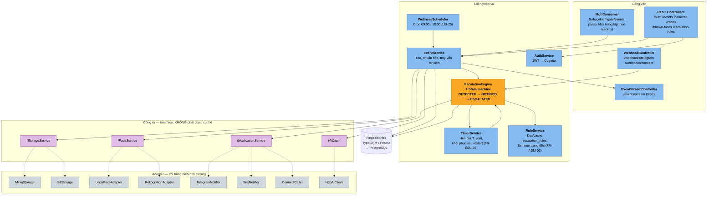
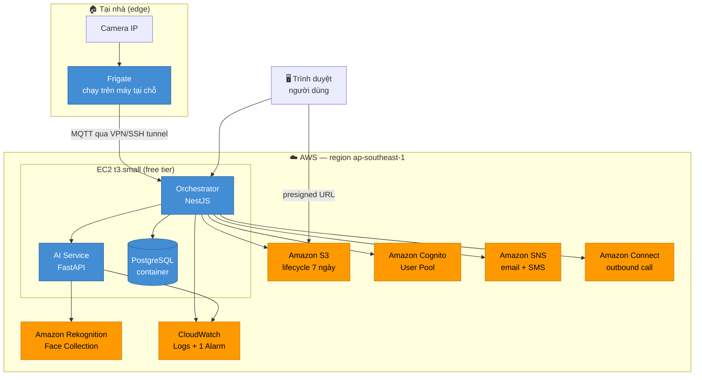
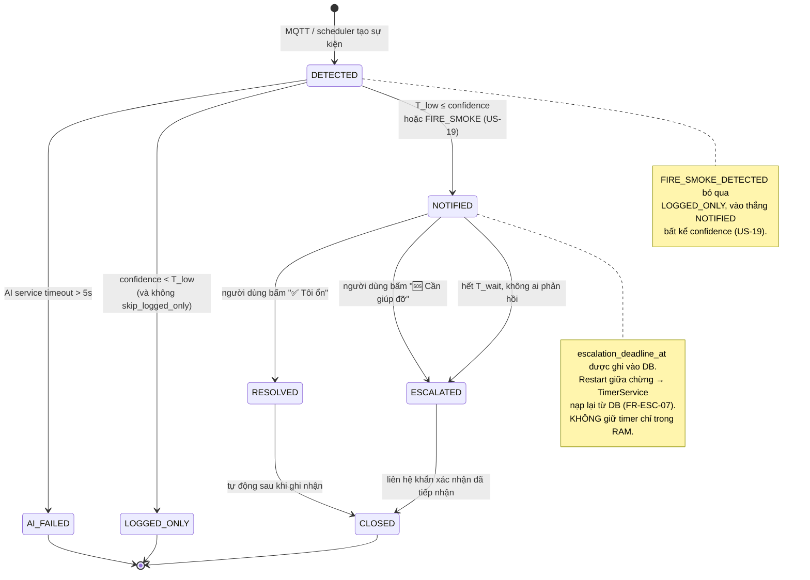

# Kiến trúc hệ thống — Mô hình C4

> **Task 0.2** · Người phụ trách: **B** (Backend Lead) · Sprint 0
> Tài liệu này là nguồn sự thật về kiến trúc. Mọi PR làm thay đổi ranh giới giữa các
> service **phải** cập nhật file này trong cùng PR.

## Mục lục

- [0. Đọc tài liệu này thế nào](#0-đọc-tài-liệu-này-thế-nào)
- [1. C1 — System Context](#1-c1--system-context)
- [2. C2 — Container](#2-c2--container)
- [3. C3 — Component (bên trong Orchestrator)](#3-c3--component-bên-trong-orchestrator)
- [4. Kiến trúc triển khai AWS (Sprint 4)](#4-kiến-trúc-triển-khai-aws-sprint-4)
- [5. State machine của sự kiện](#5-state-machine-của-sự-kiện)
- [6. Nguyên tắc kiến trúc bắt buộc](#6-nguyên-tắc-kiến-trúc-bắt-buộc)
- [7. Quyết định kiến trúc (ADR rút gọn)](#7-quyết-định-kiến-trúc-adr-rút-gọn)

---

## 0. Đọc tài liệu này thế nào

Mô hình C4 mô tả hệ thống ở 4 mức thu phóng, như bản đồ. Nhóm dùng 3 mức đầu:

| Mức                | Trả lời câu hỏi                                         | Ai cần đọc                    |
| ------------------ | ------------------------------------------------------- | ----------------------------- |
| **C1 — Context**   | Hệ thống phục vụ ai, nói chuyện với hệ thống ngoài nào? | Cả nhóm, hội đồng chấm        |
| **C2 — Container** | Hệ thống gồm những tiến trình/dịch vụ nào chạy riêng?   | Cả nhóm — **quan trọng nhất** |
| **C3 — Component** | Bên trong một container có những khối nào?              | Người làm container đó        |
| C4 — Code          | Class/hàm cụ thể                                        | Không vẽ — đọc thẳng code     |

**Nếu bạn chỉ có 5 phút:** đọc [C2](#2-c2--container) và [luồng dữ liệu](DATA_FLOW.md).

---

## 1. C1 — System Context

Ai dùng hệ thống, và hệ thống chạm vào những gì bên ngoài.



### Ranh giới hệ thống — cái gì **không** thuộc phạm vi

| Nằm ngoài                        | Lý do                                                                                  |
| -------------------------------- | -------------------------------------------------------------------------------------- |
| Phần cứng camera                 | Hệ thống nhận RTSP, không quản lý firmware camera                                      |
| Dịch vụ cấp cứu (115)            | Hệ thống gọi **người thân**, không gọi cơ quan cứu hộ — xem mục Đạo đức trong kế hoạch |
| Nhiều hộ gia đình (multi-tenant) | Ngoài phạm vi 30 ngày (Release 1.x+)                                                   |
| Ứng dụng mobile native           | Dùng responsive web thay thế (NFR-10)                                                  |

---

## 2. C2 — Container

Đây là mức quan trọng nhất. Mỗi hộp là **một tiến trình chạy riêng** — tương ứng
một service trong [`docker-compose.yml`](../../docker-compose.yml).



### Bảng mô tả container

| Container        | Công nghệ       | Trách nhiệm                                                                                           | Người phụ trách | Không được làm                                   |
| ---------------- | --------------- | ----------------------------------------------------------------------------------------------------- | --------------- | ------------------------------------------------ |
| **mediamtx**     | Go binary       | Biến webcam/file mp4 thành luồng RTSP để dev không cần camera thật                                    | C               | —                                                |
| **Frigate**      | Python + TFLite | Phát hiện `person`, sinh track ID, kiểm tra zone, cắt snapshot/clip                                   | C               | Không quyết định cảnh báo                        |
| **Mosquitto**    | MQTT broker     | Tách rời Frigate khỏi Orchestrator. Frigate chết không kéo theo backend                               | C               | Không lưu trữ lâu dài                            |
| **Orchestrator** | NestJS          | **Bộ não.** Chuẩn hóa sự kiện, gọi AI, chạy escalation state machine, gửi thông báo, phục vụ REST API | B               | Không tự chạy model AI                           |
| **AI Service**   | FastAPI         | Suy luận thuần: nhận ảnh → trả nhãn + confidence                                                      | D, E            | **Không ghi DB, không gửi Telegram**             |
| **PostgreSQL**   | Postgres 16     | Nguồn sự thật duy nhất cho mọi trạng thái                                                             | B               | —                                                |
| **MinIO / S3**   | Object storage  | File ảnh/clip. DB chỉ lưu metadata                                                                    | B, C            | Không public bucket                              |
| **Dashboard**    | Next.js 14      | Giao diện cho P1/P3                                                                                   | A               | Không gọi thẳng DB hay MinIO ngoài presigned URL |

### Vì sao tách AI Service khỏi Orchestrator

Ba lý do, theo thứ tự quan trọng:

1. **Ngôn ngữ.** Hệ sinh thái computer vision (MediaPipe, YOLO, face_recognition) là Python.
   NestJS không có tương đương dùng được trong 30 ngày.
2. **Phân công.** D và E làm AI service, B làm orchestrator — ba người sửa ba repo con khác nhau,
   ít đụng độ merge.
3. **Chịu lỗi.** AI service chết hoặc chậm thì orchestrator vẫn ghi được sự kiện với
   `status = AI_FAILED` (US-10) — hệ thống xuống cấp chứ không sập.

Giá phải trả: thêm một chặng HTTP (~50–200 ms). Chấp nhận được so với ngân sách NFR-02 (< 5 giây).

### Vì sao một AI service chứa cả 3 module thay vì 3 service

Ba container Python trên laptop sinh viên là quá nặng (mỗi cái ~1 GB RAM khi load model).
Thay vào đó: **một service, mỗi module một file router riêng** (`app/routers/face.py`,
`pose.py`, `fire.py`). D và E vẫn sửa file khác nhau nên không đụng độ, mà chỉ tốn một container.

Nếu Sprint 3 thấy một module ngốn tài nguyên làm chậm module khác, tách ra lúc đó — cấu trúc
router đã sẵn sàng cho việc tách.

---

## 3. C3 — Component (bên trong Orchestrator)

Đây là phần sinh viên hay làm rối nhất, nên vẽ chi tiết.



### Quy tắc phụ thuộc (bắt buộc)

```
Controller  →  Service  →  Repository  →  Database
                  ↓
              Interface  ←  Adapter (AWS / Telegram / MinIO)
```

- Controller **không** được gọi thẳng Repository.
- Service **không** được `import` class adapter cụ thể — chỉ inject interface.
- Adapter **không** được chứa logic nghiệp vụ, chỉ dịch qua lại với bên ngoài.

Vi phạm quy tắc này là lý do chính đáng để từ chối PR.

---

## 4. Kiến trúc triển khai AWS (Sprint 4)



### Vì sao Frigate ở lại edge, không lên cloud

Đẩy video liên tục lên cloud là thứ đắt nhất trong toàn hệ thống. Frigate xử lý tại chỗ và
chỉ gửi lên **metadata + một tấm ảnh** cho mỗi sự kiện — vài KB thay vì vài GB mỗi giờ.
Đây cũng là lý do **Kinesis Video Streams bị loại** khỏi phạm vi (rủi ro R2, ngân sách NFR-08 < 10 USD).

### Dịch vụ AWS và user story tương ứng

| Dịch vụ     | US    | Thay thế cho           | Free tier                                   |
| ----------- | ----- | ---------------------- | ------------------------------------------- |
| S3          | US-23 | MinIO                  | 5 GB                                        |
| Rekognition | US-24 | face_recognition local | 5.000 ảnh/tháng (12 tháng đầu)              |
| Cognito     | US-25 | JWT tự viết            | 50.000 MAU                                  |
| SNS         | US-26 | — (thêm kênh)          | 1.000 email, 100 SMS                        |
| Connect     | US-27 | — (thêm kênh)          | Trả theo phút — **chỉ demo 1 số đã verify** |
| CloudWatch  | US-28 | log ra stdout          | 5 GB log                                    |

---

## 5. State machine của sự kiện

Đây là logic trung tâm của cả hệ thống (US-13). Mọi module AI đều đổ vào đúng máy trạng thái này.



### Tham số theo loại sự kiện

Lấy từ `escalation_rules` trong DB, **không hard-code**. Giá trị khởi tạo ở
[`db/migrations/0002_seed_escalation_rules.sql`](../../db/migrations/0002_seed_escalation_rules.sql):

| event_type            | Priority | T_low | T_high | T_wait | Bỏ qua LOGGED_ONLY |
| --------------------- | -------- | ----- | ------ | ------ | ------------------ |
| `FIRE_SMOKE_DETECTED` | P0       | 0.50  | 0.70   | 30 s   | ✅                 |
| `FALL_DETECTED`       | P1       | 0.55  | 0.75   | 60 s   | —                  |
| `RESTRICTED_ZONE`     | P1       | 0.60  | 0.80   | 60 s   | —                  |
| `UNKNOWN_PERSON`      | P2       | 0.60  | 0.80   | 120 s  | —                  |
| `WELLNESS_TIMEOUT`    | P2       | —     | —      | 300 s  | ✅                 |
| `PERSON_DETECTED`     | P3       | —     | —      | 0      | —                  |

### Ba bẫy hay gặp khi làm state machine

1. **Giữ timer trong RAM.** Service restart lúc 2 giờ sáng → mất hết cảnh báo đang chờ.
   Phải ghi `escalation_deadline_at` xuống DB và nạp lại khi khởi động.
2. **Cho phép chuyển trạng thái tùy tiện.** `RESOLVED → NOTIFIED` là vô nghĩa nhưng code
   không chặn thì vẫn xảy ra. Viết bảng chuyển hợp lệ và kiểm tra ở một chỗ duy nhất.
3. **Hai người bấm nút cùng lúc.** Chỉ lần đầu tiên được tính (partial unique index
   `uq_confirmations_lan_dau_tien`), lần sau trả `409 ALREADY_CONFIRMED` nhưng **vẫn ghi lại**
   để kiểm toán.

---

## 6. Nguyên tắc kiến trúc bắt buộc

### NT-1 · Mọi dịch vụ AWS nằm sau một interface

```typescript
// ✅ Đúng — service không biết đang chạy MinIO hay S3
constructor(@Inject('IStorageService') private storage: IStorageService) {}

// ❌ Sai — khóa cứng vào một provider, không mock được khi test
constructor(private s3: S3Client) {}
```

Đổi provider = đổi một biến môi trường, không sửa business logic. Đây cũng là điều kiện để
unit test chạy được mà không cần credential AWS.

### NT-2 · Feature flag cho mọi thứ có thể hỏng lúc demo

`FACE_PROVIDER=local|rekognition` là **bắt buộc**, không phải tùy chọn (rủi ro R7).
Rekognition trục trặc đúng hôm demo → đổi một biến, restart, 10 giây là xong.

### NT-3 · PostgreSQL là nguồn sự thật duy nhất

Không có trạng thái nghiệp vụ nào chỉ tồn tại trong RAM của một service. Timer, cache
ngưỡng, trạng thái theo dõi té ngã — tất cả đều phải khôi phục được từ DB (NFR-05).

_Ngoại lệ duy nhất:_ bộ đệm frame của AI service khi theo dõi té ngã. Mất nó chỉ làm hủy
một candidate đang theo dõi, không mất cảnh báo đã sinh ra.

### NT-4 · AI service không biết gì về nghiệp vụ

AI service nhận ảnh, trả nhãn + confidence. Nó **không** biết ngưỡng nào là đủ để báo động,
**không** ghi DB, **không** gửi Telegram. Mọi quyết định thuộc về orchestrator.

Lý do: khi Sprint 4 phải chỉnh ngưỡng để giảm FAR, chỉ sửa một chỗ.

### NT-5 · Suy giảm có kiểm soát, không sập

| Thành phần chết | Hệ thống vẫn làm được gì                                                             |
| --------------- | ------------------------------------------------------------------------------------ |
| AI service      | Ghi sự kiện với `status = AI_FAILED`, dashboard vẫn thấy                             |
| Telegram        | Ghi `notifications.status = FAILED`, **vẫn tiếp tục đếm giờ escalation** (FR-NOT-05) |
| Rekognition     | Tự fallback về model local (FR-DET-M1-06)                                            |
| Frigate         | Orchestrator vẫn phục vụ API, dashboard vẫn xem được lịch sử                         |
| MinIO/S3        | Sự kiện vẫn ghi, chỉ thiếu ảnh                                                       |
| **PostgreSQL**  | **Không có kế hoạch B** — đây là điểm chết duy nhất được chấp nhận                   |

### NT-6 · Correlation ID xuyên suốt

Mỗi sự kiện mang một `correlation_id` từ lúc sinh ra, đi qua mọi service và mọi dòng log
(FR-LOG-02). Không có nó, gỡ lỗi "tại sao cảnh báo này không tới" là mò kim đáy bể.

---

## 7. Quyết định kiến trúc (ADR rút gọn)

| #     | Quyết định                             | Phương án bị loại      | Lý do                                                                            |
| ----- | -------------------------------------- | ---------------------- | -------------------------------------------------------------------------------- |
| ADR-1 | MQTT giữa Frigate và Orchestrator      | REST polling           | Frigate hỗ trợ MQTT sẵn; đẩy tin nhanh hơn polling; tách rời hai bên             |
| ADR-2 | Một AI service, nhiều router           | Ba microservice Python | 3 container × ~1 GB RAM quá nặng cho laptop sinh viên (R4)                       |
| ADR-3 | Polygon zone lưu tọa độ chuẩn hóa 0..1 | Lưu pixel              | Đổi độ phân giải camera không làm hỏng vùng đã vẽ                                |
| ADR-4 | PostgreSQL, không dùng MongoDB         | MongoDB                | Dữ liệu quan hệ rõ ràng; cần ràng buộc toàn vẹn và transaction cho state machine |
| ADR-5 | Frigate ở edge, không lên cloud        | Kinesis Video Streams  | Chi phí băng thông; ngân sách < 10 USD (R2, NFR-08)                              |
| ADR-6 | SSE cho cập nhật thời gian thực        | WebSocket              | Một chiều server→client là đủ; SSE tự reconnect, ít code hơn                     |
| ADR-7 | Telegram trước, SNS/Connect sau        | SNS ngay từ Sprint 2   | Telegram có nút bấm inline miễn phí — demo được luồng xác nhận sớm               |
| ADR-8 | Monorepo                               | Nhiều repo             | 5 người / 30 ngày: một PR sửa được cả spec + BE + FE, không phải đồng bộ 3 repo  |

---

## Xem tiếp

- [Luồng dữ liệu chi tiết](DATA_FLOW.md) — từng bước một, kèm payload thật
- [Thiết kế cơ sở dữ liệu (ERD)](../database/ERD.md)
- [Hợp đồng API](../api/API_GUIDE.md)
- [Quy ước code](../conventions/CODING_CONVENTION.md)
