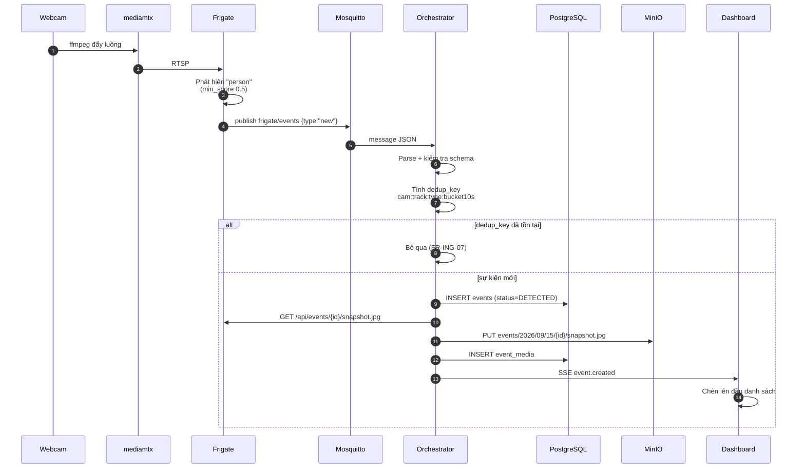
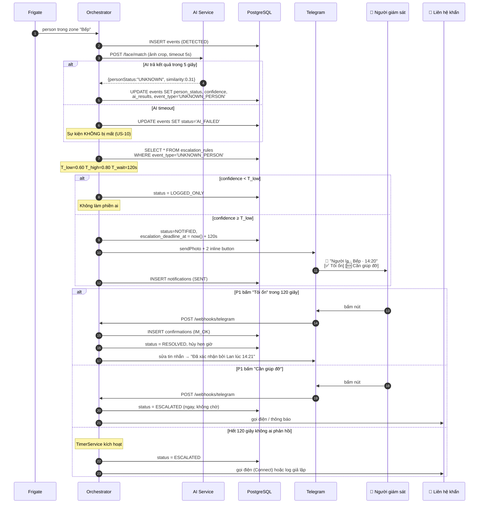
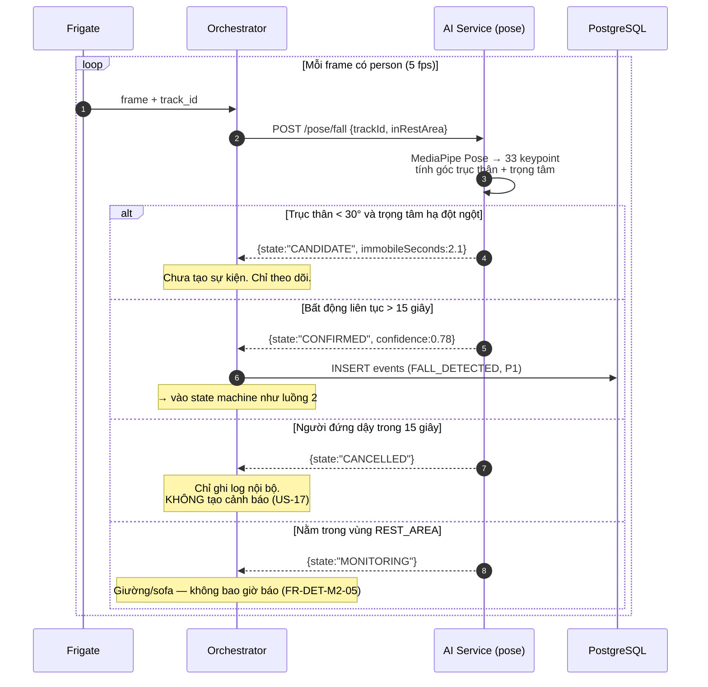
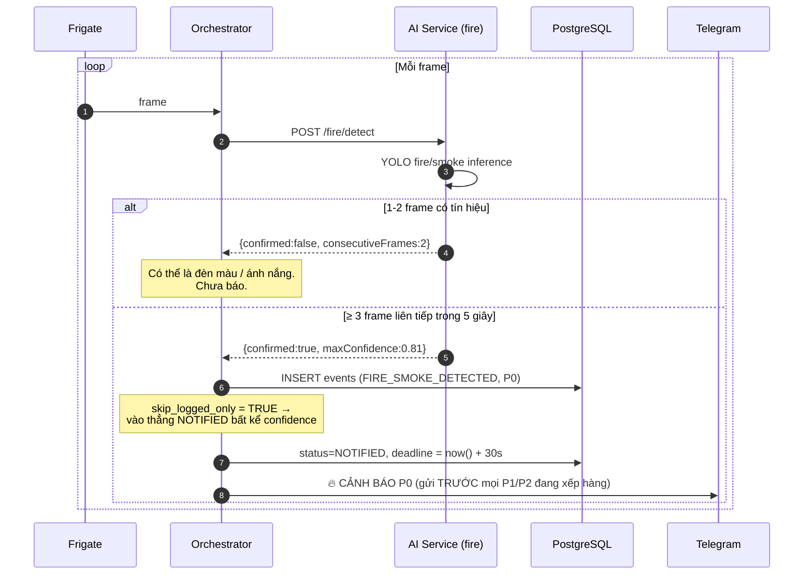
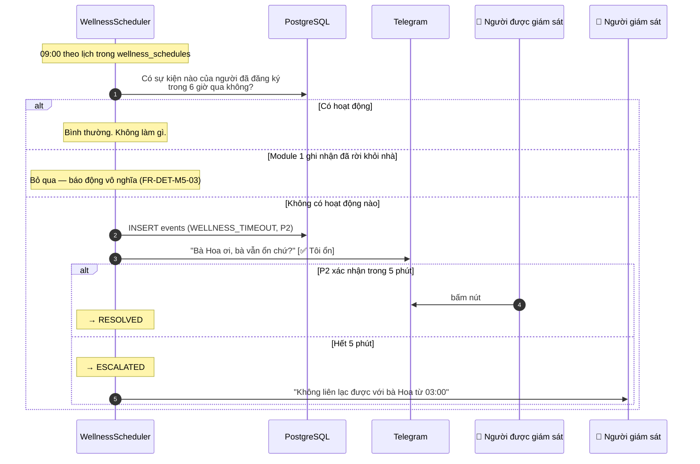
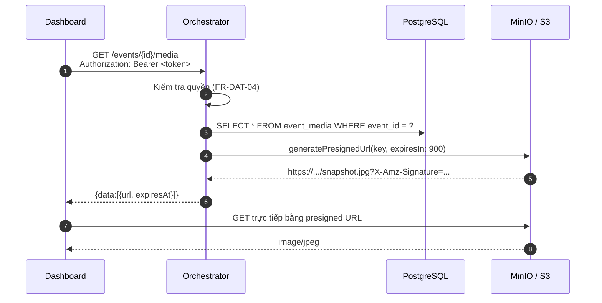

# Luồng dữ liệu

> **Task 0.2** (phần 2) · Người phụ trách: **B** · Sprint 0
> Tài liệu đi kèm [C4_ARCHITECTURE.md](C4_ARCHITECTURE.md). Ở đây mô tả **dữ liệu chảy như thế nào**,
> kèm payload thật để FE/BE/AI khớp nhau mà không phải đoán.

## Mục lục

- [Luồng 1 — Phát hiện người (walking skeleton, Sprint 1)](#luồng-1--phát-hiện-người-walking-skeleton-sprint-1)
- [Luồng 2 — Người lạ → cảnh báo → leo thang (Sprint 2)](#luồng-2--người-lạ--cảnh-báo--leo-thang-sprint-2)
- [Luồng 3 — Té ngã (Sprint 3)](#luồng-3--té-ngã-sprint-3)
- [Luồng 4 — Cháy/khói, ưu tiên P0 (Sprint 3)](#luồng-4--cháykhói-ưu-tiên-p0-sprint-3)
- [Luồng 5 — Wellness check (Sprint 3)](#luồng-5--wellness-check-sprint-3)
- [Luồng 6 — Xem ảnh/clip qua presigned URL](#luồng-6--xem-ảnhclip-qua-presigned-url)
- [Ngân sách độ trễ](#ngân-sách-độ-trễ)
- [Xử lý lỗi trên từng chặng](#xử-lý-lỗi-trên-từng-chặng)

---

## Luồng 1 — Phát hiện người (walking skeleton, Sprint 1)

Đây là đường ống phải thông trước tiên. Mọi module AI sau chỉ cắm thêm vào đúng đường ống này.



### Payload MQTT từ Frigate (rút gọn những trường nhóm thực sự dùng)

```json
{
  "type": "new",
  "before": { "...": "trạng thái trước đó, thường bỏ qua ở message type=new" },
  "after": {
    "id": "1726387200.123456-abc123",
    "camera": "cam_kitchen",
    "frame_time": 1726387200.456,
    "label": "person",
    "sub_label": null,
    "top_score": 0.87,
    "score": 0.84,
    "box": [412, 180, 640, 720],
    "area": 164_160,
    "current_zones": ["restricted_stove"],
    "entered_zones": ["restricted_stove"],
    "has_snapshot": true,
    "has_clip": false,
    "start_time": 1726387200.123,
    "end_time": null
  }
}
```

> **Chú ý:** `after.camera` là **slug** — khớp với cột `cameras.slug` trong DB.
> `after.id` chính là **track ID**, dùng làm `events.track_id`.
> `box` là **pixel** theo khung `detect`, phải chuẩn hóa chia cho `detect_width`/`detect_height`
> trước khi lưu vào `ai_results`.
> Payload **không** chứa đường dẫn snapshot: khi `after.has_snapshot = true`, lấy ảnh qua
> `GET http://frigate:5000/api/events/{after.id}/snapshot.jpg`.
> Khi track kết thúc, Frigate gửi thêm một message `"type": "end"` cùng `after.id`, có `after.end_time`.
>
> Cấu hình Frigate, cách chạy thử và bảng ánh xạ trường AC ↔ payload:
> [FRIGATE_MQTT_SETUP.md](../FRIGATE_MQTT_SETUP.md) (US-01, US-02).

### Bản ghi `events` sau khi orchestrator xử lý

```json
{
  "id": "0192f8a1-...",
  "camera_id": "<uuid của cam_kitchen>",
  "zone_id": "<uuid của restricted_stove>",
  "event_type": "PERSON_DETECTED",
  "status": "DETECTED",
  "priority": "P3",
  "source": "FRIGATE",
  "track_id": "1726387200.123456-abc123",
  "dedup_key": "cam_kitchen:1726387200.123456-abc123:PERSON_DETECTED:172638720",
  "confidence": 0.84,
  "ai_results": [],
  "correlation_id": "c0ffee00-...",
  "detected_at": "2026-09-15T14:20:00.456+07:00"
}
```

### Quy tắc khử trùng lặp (FR-ING-07)

Frigate bắn nhiều message cho cùng một track khi đối tượng di chuyển. Công thức:

```
dedup_key = "{camera_slug}:{track_id}:{event_type}:{floor(frame_time / 10)}"
```

Cột `dedup_key` có **unique index**, nên chống trùng lặp được đảm bảo ở tầng database —
kể cả khi chạy hai instance orchestrator song song. Không dựa vào kiểm tra trong code.

---

## Luồng 2 — Người lạ → cảnh báo → leo thang (Sprint 2)

Đây là luồng đầy đủ nhất, chạm vào gần như mọi thành phần.



### Vì sao `escalation_deadline_at` phải nằm trong DB

`setTimeout()` sống trong RAM. Service restart lúc 2 giờ sáng → mọi cảnh báo đang chờ biến mất
mà không ai biết. Cách làm đúng:

1. Khi chuyển sang `NOTIFIED`: ghi `escalation_deadline_at = now() + t_wait_seconds`.
2. `TimerService` chạy mỗi 10 giây, quét:
   ```sql
   SELECT id FROM events
   WHERE status = 'NOTIFIED' AND escalation_deadline_at <= now();
   ```
   (có partial index `idx_events_dang_cho_escalate` nên truy vấn này rất nhẹ)
3. Khi khởi động: chạy đúng truy vấn trên một lần để dọn những sự kiện đã quá hạn khi service chết.

Đây là yêu cầu FR-ESC-07 và NFR-05 — **sẽ bị hỏi khi bảo vệ đồ án.**

---

## Luồng 3 — Té ngã (Sprint 3)

Khác hai luồng trên ở chỗ: quyết định dựa trên **chuỗi frame**, không phải một ảnh.



### Ba cơ chế chống báo động giả

| Cơ chế                            | Chống trường hợp                 | FR           |
| --------------------------------- | -------------------------------- | ------------ |
| Ngưỡng thời gian bất động 15 giây | Cúi xuống nhặt đồ, buộc dây giày | FR-DET-M2-03 |
| Hủy candidate khi đứng dậy        | Ngồi xổm rồi đứng lên            | FR-DET-M2-04 |
| Bỏ qua vùng `REST_AREA`           | Nằm ngủ trên giường/sofa         | FR-DET-M2-05 |

> **Bắt buộc:** `FALL_IMMOBILITY_SECONDS` đọc từ biến môi trường. Con số 15 giây sẽ phải
> chỉnh lại ở Sprint 4 dựa trên FAR đo được — hard-code là tự chuốc việc vào thân.

---

## Luồng 4 — Cháy/khói, ưu tiên P0 (Sprint 3)



### Hàng đợi ưu tiên (FR-ESC-08)

Khi nhiều sự kiện chờ gửi cùng lúc, P0 được gửi trước. Cách làm đơn giản nhất mà đủ dùng:
sắp xếp hàng đợi theo `(priority ASC, detected_at ASC)` trước mỗi lượt gửi. Không cần message
queue riêng cho quy mô đồ án này.

---

## Luồng 5 — Wellness check (Sprint 3)

Module duy nhất **không dùng computer vision** — thuần logic scheduler.



Module này rẻ nhất trong backlog (3 SP) nhưng bắt được một loại rủi ro mà 4 module kia không thấy:
người nằm im trong phòng camera không phủ tới.

---

## Luồng 6 — Xem ảnh/clip qua presigned URL



**Ba điều tuyệt đối không làm:**

1. ❌ Mở public bucket "cho tiện" — lộ ảnh riêng tư trong nhà người khác.
2. ❌ Cho ảnh chạy qua orchestrator (`res.pipe(stream)`) — tốn băng thông và RAM vô ích.
3. ❌ Presigned URL hạn dài (vài ngày) — link rò ra là ai cũng xem được.

Hạn 15 phút là đủ cho người dùng xem xong, ngắn đến mức link rò ra cũng vô hại.

---

## Ngân sách độ trễ

NFR-01 yêu cầu **< 10 giây** từ lúc sự kiện xảy ra đến khi người dùng nhận thông báo.
Phân bổ ngân sách cho từng chặng để biết chặng nào đang ăn hết thời gian:

| #   | Chặng                                 | Ngân sách | Đo bằng                        |
| --- | ------------------------------------- | --------- | ------------------------------ |
| 1   | Camera → Frigate phát hiện            | 1.0 s     | `frame_time` vs `start_time`   |
| 2   | Frigate → MQTT → Orchestrator         | 0.2 s     | log timestamp hai đầu          |
| 3   | Orchestrator ghi DB                   | 0.1 s     | log truy vấn                   |
| 4   | Gọi AI service suy luận               | 2.0 s     | `ai_processed_at − created_at` |
| 5   | Escalation engine quyết định          | 0.1 s     | log                            |
| 6   | Gửi Telegram                          | 1.5 s     | `notifications.sent_at`        |
|     | **Tổng**                              | **~5 s**  | còn 5 s dự phòng               |
|     | _NFR-02: đến khi hiện trên dashboard_ | _< 5 s_   | chặng 1–3 + SSE                |

**Cách đo:** mọi log ghi kèm `correlation_id`. Đến Sprint 4, lọc log theo một
`correlation_id` là dựng lại được toàn bộ dòng thời gian của một sự kiện.

---

## Xử lý lỗi trên từng chặng

| Chặng hỏng                       | Hành vi bắt buộc                                                 | FR                   |
| -------------------------------- | ---------------------------------------------------------------- | -------------------- |
| RTSP mất kết nối                 | Ghi log, tự thử lại sau 30 s, **không crash**                    | FR-ING-03            |
| Message MQTT sai định dạng       | Ghi vào dead-letter log, consumer **vẫn sống**                   | US-03, US-08         |
| AI service timeout > 5 s         | `status = AI_FAILED`, sự kiện vẫn được lưu                       | US-10                |
| Rekognition lỗi                  | Tự fallback về model local, ghi cảnh báo                         | FR-DET-M1-06         |
| Upload MinIO/S3 thất bại         | Retry 3 lần (2 s / 4 s / 8 s), sự kiện vẫn tồn tại không có ảnh  | US-29                |
| Telegram lỗi                     | Retry 3 lần, ghi `FAILED`, **vẫn tiếp tục đếm giờ escalation**   | FR-NOT-03, FR-NOT-05 |
| Một camera bắn > 20 sự kiện/phút | Kích hoạt rate limit, gộp thành 1 cảnh báo tổng hợp              | FR-ADM-05            |
| PostgreSQL chết                  | Không có kế hoạch B — dừng nhận sự kiện mới, ghi log lỗi rõ ràng | —                    |

### Mẫu retry dùng chung

```
lần 1: thử ngay
lần 2: sau 2 giây
lần 3: sau 4 giây
lần 4: sau 8 giây
→ thất bại: ghi dead-letter + notification.status = 'FAILED'
```

Cài một lần trong `RetryService`, dùng lại ở mọi adapter. Đừng mỗi người viết một kiểu retry.

---

## Xem tiếp

- [Kiến trúc C4](C4_ARCHITECTURE.md)
- [ERD](../database/ERD.md) — cấu trúc của mọi bảng nhắc tới ở đây
- [Hợp đồng API](../api/API_GUIDE.md)
