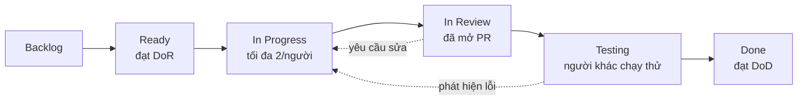

# Quy trình Git và mẫu PR

> **Task 0.9** · Người phụ trách: **B** (Scrum Master) · Sprint 0
> Mẫu PR thực thi: [`.github/pull_request_template.md`](../../.github/pull_request_template.md)

## Mục lục

- [1. Mô hình nhánh](#1-mô-hình-nhánh)
- [2. Đặt tên nhánh](#2-đặt-tên-nhánh)
- [3. Commit message](#3-commit-message)
- [4. Vòng đời một task](#4-vòng-đời-một-task)
- [5. Pull Request](#5-pull-request)
- [6. Review code](#6-review-code)
- [7. Bảo vệ nhánh main](#7-bảo-vệ-nhánh-main)
- [8. Xử lý xung đột](#8-xử-lý-xung-đột)
- [9. Tình huống thường gặp](#9-tình-huống-thường-gặp)
- [10. Windows và CRLF](#10-windows-và-crlf)

---

## 1. Mô hình nhánh

Dùng **trunk-based development** rút gọn: một nhánh `main` luôn xanh, mọi việc khác là
nhánh ngắn ngày.

```
main ────●────●────●────●────●────●────────►  luôn deploy được, CI luôn xanh
          \        /      \      /
           ●──●──●         ●──●──●            nhánh tính năng, sống < 3 ngày
```

### Vì sao không dùng Git Flow

Git Flow có `develop`, `release/*`, `hotfix/*` — hợp lý cho sản phẩm có nhiều phiên bản
chạy song song. Với 5 người trong 30 ngày, nó chỉ tạo thêm bước merge và cơ hội xung đột.

### Quy tắc bất di bất dịch

1. **Không bao giờ push thẳng vào `main`.** Mọi thay đổi đi qua PR.
2. **Nhánh sống tối đa 3 ngày.** Lâu hơn thì gần như chắc chắn task quá to — tách nhỏ ra.
   Đây là cách chống rủi ro R8 (tích hợp muộn, vỡ ở tuần cuối).
3. **`main` phải luôn `docker compose up` chạy được.** Merge vào làm hỏng `main` là sự cố
   nghiêm trọng nhất — sửa ngay lập tức, gác mọi việc khác.
4. **Không merge PR của chính mình.** Không có ngoại lệ, kể cả sửa một dấu phẩy.

---

## 2. Đặt tên nhánh

```
<loại>/<mã-story>-<mô-tả-ngắn-không-dấu>
```

| Loại       | Dùng cho                        | Ví dụ                                 |
| ---------- | ------------------------------- | ------------------------------------- |
| `feat`     | Tính năng mới                   | `feat/US-13-escalation-state-machine` |
| `fix`      | Sửa lỗi                         | `fix/US-14-telegram-retry-backoff`    |
| `docs`     | Tài liệu                        | `docs/sprint0-erd`                    |
| `chore`    | Việc vặt, cấu hình              | `chore/update-eslint-config`          |
| `refactor` | Sửa cấu trúc, không đổi hành vi | `refactor/tach-storage-adapter`       |
| `test`     | Chỉ thêm test                   | `test/US-13-state-machine-cases`      |
| `ci`       | Pipeline                        | `ci/them-job-migration`               |

**Quy tắc:** chữ thường, dùng `-`, không dấu tiếng Việt, tối đa ~50 ký tự.
Mã story giúp nhìn `git branch -a` là biết ai đang làm gì.

---

## 3. Commit message

Theo [Conventional Commits](https://www.conventionalcommits.org/). `commitlint` kiểm tra
tự động ở hook `commit-msg` và trong CI.

```
<loại>(<phạm vi>): <mô tả ngắn bằng tiếng Việt>

[thân — tùy chọn, giải thích TẠI SAO]

[footer — tùy chọn, refs #issue]
```

### Loại và phạm vi hợp lệ

| Loại       | Ý nghĩa                         |
| ---------- | ------------------------------- |
| `feat`     | Tính năng mới                   |
| `fix`      | Sửa lỗi                         |
| `docs`     | Chỉ tài liệu                    |
| `style`    | Định dạng, không đổi logic      |
| `refactor` | Sửa cấu trúc, không đổi hành vi |
| `perf`     | Cải thiện hiệu năng             |
| `test`     | Thêm/sửa test                   |
| `build`    | Build system, dependency        |
| `ci`       | Pipeline CI                     |
| `chore`    | Việc vặt khác                   |
| `revert`   | Hoàn tác commit trước           |

**Phạm vi** (`scope`) bắt buộc, chọn một trong:
`orchestrator` · `web` · `ai` · `contracts` · `db` · `infra` · `api` · `ci` · `docs` · `deps` · `repo`

### Ví dụ đúng

```
feat(orchestrator): thêm khôi phục hẹn giờ escalation sau restart

TimerService trước đây dùng setTimeout nên restart là mất hết cảnh báo
đang chờ. Nay ghi escalation_deadline_at xuống DB và quét mỗi 10 giây.

Refs #42, FR-ESC-07
```

```
fix(ai): không báo té ngã khi người nằm trong vùng REST_AREA
feat(web): thêm bộ lọc theo loại sự kiện ở trang lịch sử
docs(db): cập nhật ERD sau khi thêm bảng event_status_history
chore(deps): nâng NestJS lên 10.4.4
```

### Ví dụ sai

| Sai                       | Vì sao                                        |
| ------------------------- | --------------------------------------------- |
| `update code`             | Không có loại, không có phạm vi, không nói gì |
| `fix bug`                 | Bug nào?                                      |
| `feat: thêm API`          | Thiếu phạm vi                                 |
| `FEAT(web): ...`          | Loại phải viết thường                         |
| `feat(web): Thêm bộ lọc.` | Không kết thúc bằng dấu chấm                  |

### Kích cỡ commit

Một commit = một thay đổi có nghĩa. Không gộp "sửa lỗi + đổi tên biến + thêm test" vào một commit.

```bash
# Commit từng phần, không phải git add -A
git add apps/orchestrator/src/escalation/
git commit -m "feat(orchestrator): thêm bảng chuyển trạng thái hợp lệ"

git add apps/orchestrator/test/
git commit -m "test(orchestrator): phủ 7 nhánh của state machine"
```

---

## 4. Vòng đời một task



### Các bước cụ thể

```bash
# 1. Đồng bộ main
git checkout main
git pull origin main

# 2. Tạo nhánh
git checkout -b feat/US-13-escalation-state-machine

# 3. Làm việc, commit nhỏ và thường xuyên
git add <file cụ thể>
git commit -m "feat(orchestrator): thêm bảng chuyển trạng thái hợp lệ"

# 4. Đồng bộ với main HÀNG NGÀY (rebase, không merge)
git fetch origin
git rebase origin/main

# 5. Kiểm tra trước khi mở PR
pnpm check:all      # Prettier, ESLint, TS, test, OpenAPI, ruff, pytest
docker compose up -d && docker compose ps    # mọi container phải healthy

# 6. Đẩy lên
git push -u origin feat/US-13-escalation-state-machine

# 7. Mở PR trên GitHub, điền mẫu PR, gắn reviewer

# 8. Chờ CI xanh + 1 approve, rồi Squash and merge

# 9. Dọn dẹp
git checkout main && git pull origin main
git branch -d feat/US-13-escalation-state-machine
```

> **Rebase hằng ngày là bắt buộc**, không phải khuyến nghị. Nhánh 3 ngày không rebase
> sẽ biến việc merge thành một buổi tối vật lộn với xung đột.

---

## 5. Pull Request

### Mở PR thế nào

Mẫu PR ([`.github/pull_request_template.md`](../../.github/pull_request_template.md)) tự
điền khi bấm "New pull request". **Điền hết**, không xóa mục nào.

### Kích cỡ PR

| Số dòng thay đổi | Đánh giá                                               |
| ---------------- | ------------------------------------------------------ |
| < 200            | 👍 Lý tưởng — review kỹ trong 15 phút                  |
| 200–500          | 🙂 Chấp nhận được                                      |
| 500–1000         | ⚠️ Nên tách, nếu không review sẽ hời hợt               |
| > 1000           | ❌ Tách ra, trừ khi là code sinh tự động hoặc tài liệu |

PR quá to thì người review sẽ lướt qua và bấm approve — mất luôn giá trị của việc review.

### PR nháp (Draft)

Mở Draft PR sớm khi muốn xin ý kiến về hướng làm, hoặc muốn CI chạy thử. Draft PR không
làm phiền reviewer, nhưng cho cả nhóm thấy bạn đang làm gì.

### Trước khi bấm "Ready for review"

- [ ] Đã tự đọc lại toàn bộ diff của mình một lượt
- [ ] CI xanh
- [ ] Không còn code debug, `console.log`, file rác
- [ ] Đã rebase lên `main` mới nhất

---

## 6. Review code

### Ai review ai

[`CODEOWNERS`](../../.github/CODEOWNERS) tự động gán reviewer theo vùng code, tương ứng
phân công backup trong kế hoạch: A↔B (web), D↔E (AI), C↔B (hạ tầng).

**Bắt buộc ≥ 1 approve.** Thay đổi trong `api/` cần **cả A và B** duyệt vì đó là hợp đồng
giữa frontend và backend.

### Thời hạn

| Việc                         | Hạn                                                   |
| ---------------------------- | ----------------------------------------------------- |
| Phản hồi PR lần đầu          | **Trong 24 giờ**                                      |
| Tác giả xử lý góp ý          | Trong 24 giờ                                          |
| Lead time từ mở PR đến merge | Mục tiêu < 24 giờ (chỉ số theo dõi ở mục 12 kế hoạch) |

PR nằm quá 24 giờ không ai động đến thì nhắc trong standup.

### Người review tìm gì

Theo thứ tự ưu tiên:

1. **Đúng không** — có làm đúng acceptance criteria của story không?
2. **Có lỗ hổng không** — trường hợp biên, lỗi, race condition, null
3. **Có test không** — logic mới có được phủ không? Test có kiểm tra đúng thứ cần kiểm tra không?
4. **An toàn không** — secret, SQL injection, thiếu kiểm tra quyền
5. **Đọc được không** — người thứ ba đọc có hiểu không?
6. **Có đúng kiến trúc không** — controller có gọi thẳng repository không? Service có import adapter cụ thể không?

**Không review:** định dạng, dấu cách, thứ tự import — máy đã lo rồi.

### Viết nhận xét thế nào

```
❌ "Code này sai."
✅ "Chỗ này nếu `zones` rỗng thì `zones[0]` sẽ là undefined và ném lỗi ở dòng dưới.
    Thêm kiểm tra hoặc dùng optional chaining được không?"

❌ "Xấu quá."
✅ "Hàm này đang làm 3 việc: parse, validate, và ghi DB. Tách ra sẽ dễ test hơn —
    nhưng nếu gấp thì để Sprint sau cũng được, mình không chặn PR vì việc này."

❌ "Tại sao không dùng X?"
✅ "Mình thấy chỗ khác dùng `RetryService`, ở đây tự viết lại retry có lý do riêng không?"
```

### Ba mức nhận xét — ghi rõ mức

| Nhãn        | Ý nghĩa                           |
| ----------- | --------------------------------- |
| **[chặn]**  | Phải sửa trước khi merge          |
| **[nên]**   | Nên sửa nhưng không chặn          |
| **[góp ý]** | Chỉ là ý kiến, tác giả quyết định |

Ghi nhãn giúp tác giả biết cái gì phải làm ngay, cái gì để sau — tránh tình trạng PR bị
treo vì một góp ý về tên biến.

### Người được review nên làm gì

- Trả lời **mọi** nhận xét, kể cả chỉ "Đã sửa" hoặc "Mình giữ nguyên vì...".
- Không tự ý resolve nhận xét của người khác — để người nêu tự resolve.
- Bất đồng thì tranh luận bằng lý lẽ kỹ thuật. Không thống nhất được sau 2 lượt thì hỏi B
  (Scrum Master) hoặc đưa ra standup — **không để PR treo quá 24 giờ vì tranh luận**.

---

## 7. Bảo vệ nhánh main

Cấu hình **một lần** ở Sprint 0. Trên GitHub: _Settings → Branches → Add rule_, pattern `main`:

- ✅ Require a pull request before merging
- ✅ Require approvals: **1**
- ✅ Dismiss stale pull request approvals when new commits are pushed
- ✅ Require review from Code Owners
- ✅ Require status checks to pass before merging
  - Chọn **`CI xanh`** (job tổng hợp trong [`ci.yml`](../../.github/workflows/ci.yml))
  - ✅ Require branches to be up to date before merging
- ✅ Require conversation resolution before merging
- ❌ Allow force pushes — **tắt**
- ❌ Allow deletions — **tắt**

> **Chọn job `CI xanh`, không chọn từng job lẻ.** Sau này thêm job mới vào CI, không phải
> vào cài đặt GitHub sửa lại.

### Cách merge: Squash and merge

Chỉ bật **Squash and merge**, tắt hai lựa chọn còn lại.

Lý do: nhánh tính năng có 15 commit kiểu "wip", "fix typo", "sửa lại". Squash biến chúng
thành một commit sạch trên `main`. Lịch sử `main` đọc được, `git bisect` dùng được,
mỗi commit tương ứng một story.

Sửa tiêu đề commit khi squash cho đúng Conventional Commits:

```
feat(orchestrator): thêm khôi phục hẹn giờ escalation (#42)
```

---

## 8. Xử lý xung đột

### Phòng hơn chữa

| Việc                                                | Tác dụng                               |
| --------------------------------------------------- | -------------------------------------- |
| Rebase lên `main` hằng ngày                         | Xung đột nhỏ, sửa 2 phút thay vì 2 giờ |
| Nhánh sống < 3 ngày                                 | Ít cơ hội đụng độ                      |
| Mỗi người sở hữu một vùng code rõ ràng              | Xem CODEOWNERS                         |
| Đổi `api/openapi.yaml` thì merge riêng một PR trước | Không kéo theo xung đột ở FE lẫn BE    |

### Khi đã có xung đột

```bash
git fetch origin
git rebase origin/main

# Sửa từng file xung đột
git status
# ... mở file, xóa <<<<<<< ======= >>>>>>>, giữ đúng phần cần giữ

git add <file đã sửa>
git rebase --continue

# Chạy lại test — rebase xong mà chưa test là lỗi hay gặp
pnpm test

git push --force-with-lease
```

> `--force-with-lease`, **không phải** `--force`. Nó từ chối đẩy nếu người khác vừa push
> lên nhánh đó — cứu bạn khỏi xóa mất công của đồng đội.

### Xung đột ở file đặc biệt

| File               | Cách xử lý                                                                                                        |
| ------------------ | ----------------------------------------------------------------------------------------------------------------- |
| `pnpm-lock.yaml`   | Đừng sửa tay. `git checkout --theirs pnpm-lock.yaml && pnpm install`                                              |
| `db/migrations/*`  | **Không bao giờ** sửa file cũ. Xung đột nghĩa là hai người cùng đánh số — đổi số file của mình thành số tiếp theo |
| `api/openapi.yaml` | Gọi người kia, cùng giải quyết. Đây là hợp đồng chung, sửa một mình rất dễ sai                                    |

---

## 9. Tình huống thường gặp

### Lỡ commit vào main

```bash
git branch feat/US-XX-mo-ta        # cứu công việc sang nhánh mới
git reset --hard origin/main       # trả main về đúng trạng thái
git checkout feat/US-XX-mo-ta
```

### Lỡ commit file `.env`

```bash
git rm --cached .env
git commit -m "chore(repo): go .env khoi git"
```

**Nếu đã push lên GitHub:** coi như secret trong đó đã lộ. Đổi ngay mọi giá trị trong file
đó (JWT secret, token Telegram, key AWS) rồi báo C. Xóa khỏi lịch sử git là việc phức tạp
và không đảm bảo — đổi secret mới là cách chắc chắn.

### Sửa commit message vừa viết

```bash
git commit --amend -m "feat(orchestrator): mo ta dung"
```

Chỉ làm khi **chưa push**. Đã push rồi thì để nguyên — squash lúc merge sẽ dọn.

### Bỏ thay đổi chưa commit

```bash
git checkout -- <file>      # một file
git restore .               # tất cả — CẨN THẬN, không lấy lại được
```

### Cứu công việc đang dở để chuyển nhánh gấp

```bash
git stash push -m "dang lam escalation timer"
git checkout main
# ... xử lý việc gấp
git checkout feat/US-13-...
git stash pop
```

### Lấy một commit từ nhánh khác

```bash
git cherry-pick <sha>
```

### Xem ai sửa dòng này và vì sao

```bash
git log -p --follow apps/orchestrator/src/escalation/escalation.service.ts
git blame apps/orchestrator/src/escalation/escalation.service.ts
```

---

## 10. Windows và CRLF

Nhóm dùng Windows, CI chạy Linux. Không thống nhất thì `git diff` sẽ hiện toàn bộ file
thay đổi dù chỉ sửa một dòng.

### Cài một lần trên mỗi máy

```bash
git config --global core.autocrlf input
git config --global core.eol lf
```

Repo đã có [`.editorconfig`](../../.editorconfig) đặt `end_of_line = lf`. VS Code cần thêm:

```json
{ "files.eol": "\n" }
```

### Cấu hình git khác nên đặt

```bash
git config --global user.name "Tên thật của bạn"
git config --global user.email "email-github@example.com"
git config --global pull.rebase true          # pull = rebase, không tạo merge commit rác
git config --global init.defaultBranch main
git config --global fetch.prune true          # tự dọn nhánh remote đã xóa
```

> `user.email` phải trùng email đăng ký GitHub, nếu không commit sẽ không gắn được vào
> tài khoản của bạn — và đến lúc nộp báo cáo, đóng góp của bạn không hiện trong biểu đồ Contributors.

---

## Xem tiếp

- [Quy ước viết code](CODING_CONVENTION.md)
- [Mẫu PR](../../.github/pull_request_template.md)
- [CI pipeline](../../.github/workflows/ci.yml)
- [Hướng dẫn cài đặt môi trường](../DEV_ONBOARDING.md)
