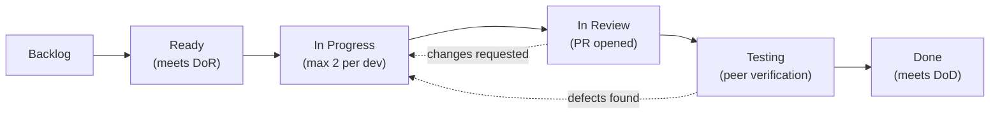

# Git Workflow & Pull Request Guidelines

> **Task 0.9** · Owner: **B** (Scrum Master) · Sprint 0  
> Executable PR template: [`.github/pull_request_template.md`](../../.github/pull_request_template.md)

## Table of Contents

- [1. Branching Model](#1-branching-model)
- [2. Branch Naming](#2-branch-naming)
- [3. Commit Messages](#3-commit-messages)
- [4. Task Lifecycle](#4-task-lifecycle)
- [5. Pull Requests](#5-pull-requests)
- [6. Code Review](#6-code-review)
- [7. Protecting the Main Branch](#7-protecting-the-main-branch)
- [8. Merge Conflicts](#8-merge-conflicts)
- [9. Common Scenarios](#9-common-scenarios)
- [10. Windows & CRLF](#10-windows--crlf)

---

## 1. Branching Model

We use a simplified **trunk-based development** model: a single `main` branch that is always green, accompanied by short-lived feature branches.

```
main ────●────●────●────●────●────●────────►  Always deployable, CI always green
          \        /      \      /
           ●──●──●         ●──●──●            Feature branches, lifespan < 3 days
```

### Why Not Git Flow?

Git Flow introduces `develop`, `release/*`, and `hotfix/*` branches — suitable for products running multiple concurrent production releases. For a 5-member team over 30 days, it only adds redundant merge ceremonies and increases the surface area for merge conflicts.

### Immutable Rules

1. **Never push directly to `main`.** All changes must pass through a Pull Request (PR).
2. **Branch lifespan must not exceed 3 days.** Longer lifespans indicate that the user story is too large and must be decomposed. This is our primary defense against Risk R8 (late integration failure in the final sprint).
3. **`main` must always be launchable via `docker compose up`.** Breaking `main` is an incident of highest severity — fix it immediately, pausing all other non-urgent tasks.
4. **Never merge your own PR.** No exceptions, not even for fixing a punctuation typo.

---

## 2. Branch Naming

Format:

```
<type>/<story-id>-<short-description>
```

| Type       | Intended For                                 | Example                               |
| :--------- | :------------------------------------------- | :------------------------------------ |
| `feat`     | New user feature or capability               | `feat/US-13-escalation-state-machine` |
| `fix`      | Bug fix                                      | `fix/US-14-telegram-retry-backoff`    |
| `docs`     | Documentation updates                        | `docs/sprint0-erd`                    |
| `chore`    | Maintenance, dependencies, config            | `chore/update-eslint-config`          |
| `refactor` | Code restructuring without behavioral change | `refactor/split-storage-adapter`      |
| `test`     | Adding or updating tests only                | `test/US-13-state-machine-cases`      |
| `ci`       | CI/CD pipeline modifications                 | `ci/add-migration-validation-job`     |

**Rules:** lowercase, words separated by hyphens (`-`), maximum ~50 characters.  
Including the user story ID enables anyone running `git branch -a` to immediately understand what is in flight.

---

## 3. Commit Messages

Commit messages adhere to [Conventional Commits](https://www.conventionalcommits.org/). Verification is automated via the `commit-msg` Husky hook using `commitlint` and validated in CI.

```
<type>(<scope>): <short summary in English>

[optional body — explains WHY the change was made]

[optional footer — refs #issue, breaking changes]
```

### Valid Types & Scopes

| Type       | Meaning                                                       |
| :--------- | :------------------------------------------------------------ |
| `feat`     | A new feature                                                 |
| `fix`      | A bug fix                                                     |
| `docs`     | Documentation only changes                                    |
| `style`    | Formatting changes that do not affect the meaning of the code |
| `refactor` | A code change that neither fixes a bug nor adds a feature     |
| `perf`     | A code change that improves performance                       |
| `test`     | Adding missing tests or correcting existing tests             |
| `build`    | Changes that affect the build system or external dependencies |
| `ci`       | Changes to CI configuration files and scripts                 |
| `chore`    | Other changes that don't modify src or test files             |
| `revert`   | Reverts a previous commit                                     |

**Scope** (`scope`) is mandatory. Choose from:
`orchestrator` · `web` · `ai` · `contracts` · `db` · `infra` · `api` · `ci` · `docs` · `deps` · `repo`

### Valid Examples

```
feat(orchestrator): add escalation timer recovery after service restart

Previously, TimerService relied on in-memory setTimeout, which caused pending
alerts to be lost upon container restart. Now persisted to PostgreSQL with
escalation_deadline_at, polled every 10 seconds.

Refs #42, FR-ESC-07
```

```
fix(ai): prevent fall alerts when person is inside REST_AREA zone
feat(web): add event type filter on incident history page
docs(db): update ERD with event_status_history schema
chore(deps): bump NestJS to 10.4.4
```

### Prohibited Examples

| Invalid                  | Reason                                        |
| :----------------------- | :-------------------------------------------- |
| `update code`            | No type, no scope, completely non-descriptive |
| `fix bug`                | Which bug? Where?                             |
| `feat: add api`          | Missing required scope                        |
| `FEAT(web): ...`         | Type must be strictly lowercase               |
| `feat(web): Add filter.` | Starts with uppercase and ends with a period  |

### Commit Granularity

One commit = one coherent, logical change. Do not bundle "bug fix + variable rename + tests" into a single monolithic commit.

```bash
# Stage and commit logically distinct chunks:
git add apps/orchestrator/src/escalation/
git commit -m "feat(orchestrator): add valid state transition table"

git add apps/orchestrator/test/
git commit -m "test(orchestrator): cover 7 branches of escalation state machine"
```

---

## 4. Task Lifecycle


```mermaid
graph LR
    A["Backlog"] --> B["Ready<br/>(meets DoR)"]
    B --> C["In Progress<br/>(max 2 per dev)"]
    C --> D["In Review<br/>(PR opened)"]
    D --> E["Testing<br/>(peer verification)"]
    E --> F["Done<br/>(meets DoD)"]
    D -.->|"changes requested"| C
    E -.->|"defects found"| C
```

### Step-by-Step Execution

```bash
# 1. Synchronize local main
git checkout main
git pull origin main

# 2. Create feature branch
git checkout -b feat/US-13-escalation-state-machine

# 3. Work and commit in small, logical increments
git add <specific-files>
git commit -m "feat(orchestrator): add valid state transition table"

# 4. Synchronize with main DAILY (rebase, do NOT merge main into branch)
git fetch origin
git rebase origin/main

# 5. Execute pre-PR verification locally
pnpm check:all                               # Prettier, ESLint, TS, tests, OpenAPI, Ruff, Pytest
docker compose up -d && docker compose ps    # Verify all containers remain healthy

# 6. Push branch to remote
git push -u origin feat/US-13-escalation-state-machine

# 7. Open PR on GitHub, complete all template checklist items, assign reviewers

# 8. Wait for green CI + ≥ 1 approval, then perform Squash and Merge

# 9. Cleanup local workspace
git checkout main && git pull origin main
git branch -d feat/US-13-escalation-state-machine
```

> **Daily rebase is mandatory**, not an optional suggestion. A branch un-rebased for 3 days turns merging into an evening-long struggle with conflicts.

---

## 5. Pull Requests

### Opening a PR

The PR template ([`.github/pull_request_template.md`](../../.github/pull_request_template.md)) automatically populates when you click "New pull request". Fill out all sections completely; do not delete checklist items.

### PR Sizing

| Changed Lines | Evaluation                                                 |
| :------------ | :--------------------------------------------------------- |
| < 200         | 👍 Ideal — Thorough review within 15 minutes               |
| 200–500       | 🙂 Acceptable                                              |
| 500–1000      | ⚠️ Consider splitting; risks superficial review            |
| > 1000        | ❌ Must split, unless pure generated code or documentation |

When a PR is too large, reviewers inevitably skim and click approve, which destroys the value of code review.

### Draft PRs

Open a Draft PR early when seeking feedback on architecture, or to trigger CI runs during development. Draft PRs do not notify reviewers for formal review, but provide visibility to the entire team.

### Pre-Review Checklist ("Ready for Review")

- [ ] Reviewed your own full diff once before requesting review
- [ ] CI pipeline is green
- [ ] No leftover debug code, temporary `console.log` statements, or scratch files
- [ ] Rebased onto latest `origin/main`

---

## 6. Code Review

### Reviewer Assignment

[`CODEOWNERS`](../../.github/CODEOWNERS) automatically assigns reviewers based on file paths, matching the cross-functional backup pairs established in the project plan: A↔B (web), D↔E (AI), C↔B (infra).

**Requirement: ≥ 1 approval.** Changes under `api/` require approvals from **both A and B** because it defines the contract binding frontend and backend.

### Service Level Agreements (SLA)

| Activity                     | Target Deadline                                |
| :--------------------------- | :--------------------------------------------- |
| First review response        | **Within 24 hours**                            |
| Author resolves comments     | Within 24 hours                                |
| Lead time (PR open to merge) | Target < 24 hours (tracked in project metrics) |

If a PR is untouched for > 24 hours, escalate it during daily standup.

### What Reviewers Look For (By Priority)

1. **Correctness** — Does it satisfy the acceptance criteria of the story?
2. **Edge Cases & Vulnerabilities** — Boundaries, race conditions, null checks, timeouts.
3. **Test Quality** — Is new business logic covered? Are assertions validating genuine behavior?
4. **Security** — Leaked secrets, SQL injection, missing authorization checks.
5. **Readability & Maintainability** — Can a third engineer understand and maintain this easily?
6. **Architecture Compliance** — Does a controller bypass a service? Does a service import concrete storage classes directly?

**Do not review:** Code formatting, trailing commas, import sorting — automated tools handle these completely.

### Constructive Feedback Examples

```
❌ "This code is wrong."
✅ "If `zones` is empty, `zones[0]` will evaluate to undefined and throw on the next line.
    Can we add a guard check or use optional chaining here?"

❌ "Looks bad."
✅ "This function handles 3 concerns: parsing, validation, and database persistence.
    Splitting them would make unit testing significantly easier."

❌ "Why not use X?"
✅ "I noticed other services use `RetryService`. Is there a specific rationale for implementing a custom retry loop here?"
```

### Three Comment Severity Levels

Prefix review comments with explicit severity tags:

| Tag            | Meaning                                                |
| :------------- | :----------------------------------------------------- |
| **[blocking]** | Must be addressed before merging                       |
| **[should]**   | Recommended improvement, but not blocking              |
| **[nit]**      | Minor suggestion or cosmetic note; author's discretion |

Explicit tagging prevents PRs from being blocked over minor naming preferences.

### Author Etiquette

- Respond to **every** comment (even a brief "Resolved" or "Opted to keep as is because...").
- Do not unilaterally resolve reviewer comment threads — let the reviewer verify and resolve their own comments.
- Resolve technical disagreements with rational arguments. If unresolved after 2 exchanges, consult B (Scrum Master) or discuss in standup — **never leave a PR hanging for > 24 hours over debates**.

---

## 7. Protecting the Main Branch

Configured in repository settings: _Settings → Branches → Branch protection rules_, branch pattern `main`:

- ✅ Require a pull request before merging
- ✅ Require approvals: **1**
- ✅ Dismiss stale pull request approvals when new commits are pushed
- ✅ Require review from Code Owners
- ✅ Require status checks to pass before merging
  - Select the composite **`CI xanh`** job (from [`.github/workflows/ci.yml`](../../.github/workflows/ci.yml))
  - ✅ Require branches to be up to date before merging
- ✅ Require conversation resolution before merging
- ❌ Allow force pushes — **Disabled**
- ❌ Allow deletions — **Disabled**

### Merge Method: Squash and Merge

**Only enable "Squash and merge"**, disabling "Create a merge commit" and "Rebase and merge".

Rationale: A feature branch may accumulate 15 intermediate commits ("wip", "fix typo", "re-test"). Squashing collapses them into one clean, atomic commit on `main`. The `main` history remains linear, readable, git-bisectable, and every commit corresponds directly to a user story.

Format the squash commit title to match Conventional Commits:

```
feat(orchestrator): add escalation timer recovery after service restart (#42)
```

---

## 8. Merge Conflicts

### Prevention Over Cure

| Practice                                         | Benefit                                                         |
| :----------------------------------------------- | :-------------------------------------------------------------- |
| Daily rebase onto `main`                         | Conflicts remain tiny, resolved in 2 minutes instead of 2 hours |
| Short branch lifespan (< 3 days)                 | Minimal divergence from trunk                                   |
| Clear code ownership                             | See `CODEOWNERS`                                                |
| Merge `api/openapi.yaml` in an isolated PR first | Avoids cascading conflicts across both frontend and backend     |

### Resolving Active Conflicts

```bash
git fetch origin
git rebase origin/main

# Check conflicted files
git status
# Open files, resolve conflict markers (<<<<<<<, =======, >>>>>>>)

git add <resolved-files>
git rebase --continue

# Re-run all tests — a common defect is failing to verify post-rebase
pnpm test

# Push rebased branch
git push --force-with-lease
```

> **Always use `--force-with-lease`**, never raw `--force`. It verifies that no teammate pushed additional commits to the remote branch while you were rebasing.

### Resolving Critical Files

| File               | Resolution Protocol                                                                                                                         |
| :----------------- | :------------------------------------------------------------------------------------------------------------------------------------------ |
| `pnpm-lock.yaml`   | Never resolve manually. Run `git checkout --theirs pnpm-lock.yaml && pnpm install`                                                          |
| `db/migrations/*`  | **Never edit existing migrations.** If two engineers used the same sequence number, renumber your migration to the next sequential integer. |
| `api/openapi.yaml` | Coordinate directly with the other contributor. This is a shared system contract; unilateral edits risk breaking client-server parity.      |

---

## 9. Common Scenarios

### Accidentally Committed Directly to `main`

```bash
git branch feat/US-XX-description       # Save work into a new branch
git reset --hard origin/main            # Reset local main to match remote
git checkout feat/US-XX-description
```

### Accidentally Committed `.env`

```bash
git rm --cached .env
git commit -m "chore(repo): untrack .env file from git"
```

**If already pushed to GitHub:** Consider all contained secrets compromised. Immediately rotate all secrets (JWT secrets, Telegram bot tokens, AWS IAM access keys) and inform engineer C. Purging git history is error-prone; rotating secrets provides guaranteed security.

### Amending the Most Recent Commit Message

```bash
git commit --amend -m "feat(orchestrator): correct descriptive message"
```

Only perform this if the commit has **not yet been pushed**. If already pushed, leave it as is — squashing during merge will sanitize it.

### Discarding Uncommitted Changes

```bash
git checkout -- <file>      # Revert a single file
git restore .               # Revert all unstaged changes (CAUTION: non-recoverable)
```

### Temporarily Shelving Work to Switch Branches

```bash
git stash push -m "WIP: escalation timer logic"
git checkout main
# ... handle urgent task
git checkout feat/US-13-...
git stash pop
```

### Cherry-Picking a Specific Commit

```bash
git cherry-pick <sha>
```

### Inspecting Change Origins and History

```bash
git log -p --follow apps/orchestrator/src/escalation/escalation.service.ts
git blame apps/orchestrator/src/escalation/escalation.service.ts
```

---

## 10. Windows & CRLF

Because developers use Windows while CI and production execute on Linux, inconsistent line endings cause `git diff` to report entire files as modified due to CR/LF mismatches.

### Mandatory Global Git Configuration

Run once on each developer workstation:

```bash
git config --global core.autocrlf input
git config --global core.eol lf
```

The repository includes an [`.editorconfig`](../../.editorconfig) enforcing `end_of_line = lf`. Ensure VS Code settings contain:

```json
{ "files.eol": "\n" }
```

### Recommended Global Git Defaults

```bash
git config --global user.name "Your Full Name"
git config --global user.email "your-github-registered-email@example.com"
git config --global pull.rebase true          # git pull rebases by default; prevents noisy merge commits
git config --global init.defaultBranch main
git config --global fetch.prune true          # Automatically prune deleted remote branch references
```

> Ensure `user.email` matches your primary GitHub account email. Otherwise, commits will not link to your GitHub profile and contributions will not appear on project reports.

---

## Further Reading

- [Coding Conventions](CODING_CONVENTION.md)
- [PR Template](../../.github/pull_request_template.md)
- [CI Pipeline Specification](../../.github/workflows/ci.yml)
- [Developer Onboarding Guide](../DEV_ONBOARDING.md)
