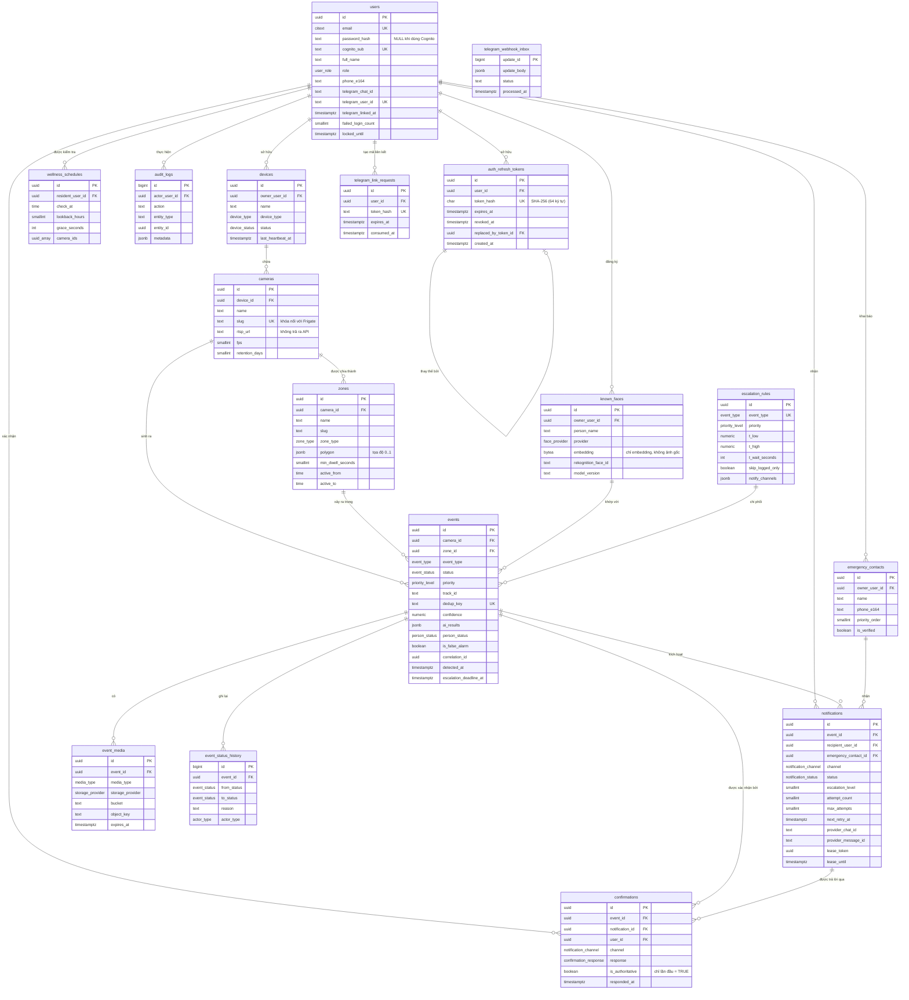

# Thiết kế cơ sở dữ liệu — ERD

> **Task 0.3** · Người phụ trách: **B** (Backend Lead) · Sprint 0
> DDL thực thi: [`db/migrations/0001_init.sql`](../../db/migrations/0001_init.sql), [`db/migrations/0002_seed_escalation_rules.sql`](../../db/migrations/0002_seed_escalation_rules.sql), [`db/migrations/0003_auth_refresh_tokens.sql`](../../db/migrations/0003_auth_refresh_tokens.sql), [`db/migrations/0007_telegram_delivery.sql`](../../db/migrations/0007_telegram_delivery.sql)
> Tài liệu này giải thích **vì sao** thiết kế như vậy. File SQL là nguồn sự thật về **cấu trúc**.

## Mục lục

- [1. Sơ đồ tổng thể](#1-sơ-đồ-tổng-thể)
- [2. Nguyên tắc thiết kế](#2-nguyên-tắc-thiết-kế)
- [3. Chi tiết từng bảng](#3-chi-tiết-từng-bảng)
- [4. Danh sách ENUM](#4-danh-sách-enum)
- [5. Chỉ mục và lý do](#5-chỉ-mục-và-lý-do)
- [6. Truy vấn mẫu hay dùng](#6-truy-vấn-mẫu-hay-dùng)
- [7. Quy trình thay đổi schema](#7-quy-trình-thay-đổi-schema)

---

## 1. Sơ đồ tổng thể

17 bảng hiện được mô tả: **10 bảng chính** theo task 0.3, **5 bảng bổ trợ** từ Sprint 0–1
và **2 bảng Telegram** của US-14.



### Vì sao có 5 bảng ngoài danh sách 10 bảng ban đầu

| Bảng                   | Sinh ra từ                  | Nếu không có thì sao                                                                                                 |
| ---------------------- | --------------------------- | -------------------------------------------------------------------------------------------------------------------- |
| `event_status_history` | FR-EVT-05, FR-ESC-09        | Không trả lời được "ai xác nhận, lúc nào, qua kênh nào" — một mục trong tiêu chí demo                                |
| `emergency_contacts`   | FR-NOT-09, FR-NOT-10        | Không gọi tuần tự 3 liên hệ được; nhồi số điện thoại vào `users` là sai mô hình (liên hệ khẩn không cần tài khoản)   |
| `wellness_schedules`   | FR-DET-M5-01                | Lịch kiểm tra phải hard-code — vi phạm "mọi tham số cấu hình được"                                                   |
| `audit_logs`           | FR-LOG-01                   | Không chứng minh được đã ghi nhận hành vi nhạy cảm (xóa dữ liệu sinh trắc học) — phần Đạo đức của báo cáo sẽ hổng    |
| `auth_refresh_tokens`  | US-05, FR-AUT-02, FR-AUT-04 | Không thể thu hồi JWT khi đăng xuất, không thể xoay vòng Refresh Token (Token Rotation) an toàn chống đánh cắp phiên |

---

## 2. Nguyên tắc thiết kế

### NT-1 · UUID làm khóa chính (trừ bảng log)

```sql
id UUID PRIMARY KEY DEFAULT gen_random_uuid()
```

- ID sinh ra được ở phía client trước khi ghi DB → tiện cho việc gắn `correlation_id` sớm.
- Không lộ số lượng bản ghi qua URL (`/events/1`, `/events/2`… là thông tin không nên tiết lộ).
- Gộp dữ liệu từ nhiều nguồn không lo trùng khóa.

**Ngoại lệ:** `event_status_history` và `audit_logs` dùng `BIGINT IDENTITY` — chỉ ghi thêm và
đọc theo thứ tự thời gian, khóa tuần tự vừa nhỏ hơn vừa cho index gọn hơn.

### NT-2 · `TIMESTAMPTZ`, không bao giờ dùng `TIMESTAMP`

Hệ thống báo cháy mà sai múi giờ là hỏng. `TIMESTAMPTZ` lưu chuẩn UTC và tự quy đổi.
Cột `cameras.timezone` giữ múi giờ hiển thị cho từng camera.

### NT-3 · ENUM của Postgres, không dùng `VARCHAR` tự do

```sql
CREATE TYPE event_status AS ENUM ('DETECTED', 'LOGGED_ONLY', ...);
```

Database từ chối giá trị sai ngay lập tức, không đợi code kiểm tra. Đổi lại phải nhớ:
**mỗi ENUM tồn tại ở 3 nơi, đổi một nơi là phải đổi cả ba.**

```
db/migrations/*.sql  ←→  packages/contracts/src/enums.ts  ←→  api/openapi.yaml
```

Đây là một mục trong [mẫu PR](../../.github/pull_request_template.md).

### NT-4 · Ràng buộc nghiệp vụ đặt ở tầng DB khi có thể

```sql
CONSTRAINT escalation_rules_t_low_khong_lon_hon_t_high
    CHECK (t_low IS NULL OR t_high IS NULL OR t_low <= t_high)
```

FR-ADM-03 nói "kiểm tra tính hợp lệ trước khi lưu". Kiểm tra ở API là cần, nhưng để DB
kiểm tra lần nữa thì dù ai gọi bằng đường nào — script seed, `psql` thủ công, endpoint mới
viết vội — dữ liệu vẫn không hỏng được.

### NT-5 · Chỉ lưu metadata của file, không lưu file

`event_media` giữ `bucket` + `object_key`. File thật ở MinIO/S3. Đưa ảnh vào cột `BYTEA`
làm DB phình rất nhanh và backup thành cực hình.

### NT-6 · Xóa dữ liệu sinh trắc học là xóa thật

`known_faces` **không có** cột `deleted_at`. FR-DEV-07 và FR-DAT-03 yêu cầu xóa hoàn toàn.
Soft-delete ở bảng này là vi phạm nguyên tắc riêng tư đã cam kết trong báo cáo.

---

## 3. Chi tiết từng bảng

### 3.1 `users`

Tài khoản đăng nhập. Ba vai trò: `ADMIN`, `CAREGIVER`, `VIEWER` (FR-AUT-05).

| Cột                                   | Ghi chú                                                 |
| ------------------------------------- | ------------------------------------------------------- |
| `email`                               | Kiểu `CITEXT` — `Lan@x.com` và `lan@x.com` là một người |
| `password_hash`                       | bcrypt/argon2. **NULL** khi tài khoản dùng Cognito      |
| `cognito_sub`                         | Ánh xạ sang Cognito User Pool khi migrate ở US-25       |
| `failed_login_count` + `locked_until` | FR-AUT-03: 5 lần sai → khóa 15 phút                     |
| `telegram_chat_id`                    | Đích để bot gửi cảnh báo (US-14)                        |

Ràng buộc `users_co_it_nhat_mot_cach_dang_nhap` đảm bảo không tạo được tài khoản
vừa không có mật khẩu vừa không có Cognito — tài khoản "ma" không ai đăng nhập được.

**Vì sao tách `linked_user_id` trong `known_faces` thay vì gộp vào `users`:** bà Hoa cần
được nhận diện nhưng không cần tài khoản đăng nhập. Người quen ≠ người dùng.

### 3.2 `devices`

Thiết bị vật lý chứa camera (edge box, NVR). Với đồ án thường chỉ có một bản ghi, nhưng
tách ra vì hai lý do: quản lý được `last_heartbeat_at` để biết cả nhà mất mạng, và
không phải sửa schema khi mở rộng sang nhiều hộ gia đình.

`ON DELETE RESTRICT` với `users`: không xóa được người dùng đang sở hữu thiết bị — buộc
phải chuyển quyền sở hữu trước.

### 3.3 `cameras`

| Cột              | Vì sao quan trọng                                                                                                                                 |
| ---------------- | ------------------------------------------------------------------------------------------------------------------------------------------------- |
| `slug`           | **Khóa nối giữa DB và Frigate.** MQTT trả về `after.camera = "cam_kitchen"`; đây chính là giá trị này. Bất biến sau khi tạo — đổi là đứt liên kết |
| `rtsp_url`       | Chứa credential camera. API **không** trả về cho role khác ADMIN (NFR-09)                                                                         |
| `fps`            | Giới hạn 1–30. Máy yếu thì hạ xuống 5 (rủi ro R4)                                                                                                 |
| `retention_days` | Cơ sở tính `event_media.expires_at` (FR-DAT-01)                                                                                                   |

### 3.4 `zones`

Vùng giám sát dạng đa giác trên khung hình (FR-DEV-02).

**`polygon` lưu tọa độ chuẩn hóa 0..1, không phải pixel.** Admin vẽ vùng trên ảnh preview
1280×720; sau này đổi camera sang 1920×1080 thì vùng vẫn đúng chỗ. Orchestrator quy đổi
sang pixel khi sinh config cho Frigate.

```json
{
  "polygon": [
    [0.4, 0.3],
    [0.95, 0.3],
    [0.95, 0.9],
    [0.4, 0.9]
  ]
}
```

Ba loại vùng (FR-DEV-03):

| `zone_type`  | Ý nghĩa                  | Hệ quả                                                |
| ------------ | ------------------------ | ----------------------------------------------------- |
| `RESTRICTED` | Bếp, cầu thang, ban công | Người vào → sự kiện `RESTRICTED_ZONE`                 |
| `REST_AREA`  | Giường, sofa             | **Không bao giờ** sinh cảnh báo té ngã (FR-DET-M2-05) |
| `NORMAL`     | Vùng thường              | Chỉ để thống kê vị trí                                |

`min_dwell_seconds` (mặc định 2 giây) loại trường hợp đi lướt qua bếp — FR-DET-M4-02.
`active_from` / `active_to` cho phép tắt giám sát ban đêm; ràng buộc `zones_lich_day_du`
bắt phải điền cả hai hoặc bỏ trống cả hai.

### 3.5 `known_faces`

Danh sách người quen. Bảng nhạy cảm nhất về mặt riêng tư.

| Cột                   | Ghi chú                                                           |
| --------------------- | ----------------------------------------------------------------- |
| `embedding` (BYTEA)   | Vector float32 đã pack. Dùng khi `provider = LOCAL`               |
| `rekognition_face_id` | FaceId từ `IndexFaces`. Dùng khi `provider = REKOGNITION` (US-24) |
| `model_version`       | Bắt buộc — embedding của model A không so khớp được với model B   |
| `source_image_count`  | 1–5 ảnh (FR-DEV-05)                                               |

Ràng buộc `known_faces_co_du_lieu_sinh_trac` đảm bảo mỗi bản ghi phải có **hoặc** embedding
local **hoặc** FaceId của Rekognition — không tồn tại bản ghi rỗng vô dụng.

> **Nâng cấp tùy chọn:** với vài chục người quen, quét tuần tự tính cosine là đủ nhanh.
> Nếu sau này cần so khớp trên hàng nghìn khuôn mặt, cài extension `pgvector` và đổi
> `embedding BYTEA` → `embedding vector(128)` để dùng index ANN. Ngoài phạm vi 30 ngày.

### 3.6 `escalation_rules`

Cấu hình ngưỡng và thời gian chờ cho từng loại sự kiện (US-15, FR-ESC-05).

Giá trị mặc định nằm trong migration `0002`, **không phải trong file seed demo** — vì
FR-ADM-04 yêu cầu mọi môi trường (dev, CI, AWS) đều phải có sẵn khi khởi tạo.

`skip_logged_only = TRUE` là cách hiện thực US-19: cháy/khói bỏ qua bậc `LOGGED_ONLY`,
vào thẳng `NOTIFIED` bất kể confidence.

`notify_channels` / `escalate_channels` là JSONB mảng thay vì bảng nối. Đây là quyết định
có ý thức: quan hệ nhiều-nhiều đúng chuẩn cần thêm 2 bảng, trong khi dữ liệu này chỉ có
6 dòng và luôn được đọc trọn gói. Không đáng.

### 3.7 `events` ⭐

Bảng trung tâm. Mọi thứ khác xoay quanh nó.

#### Nhóm cột và mục đích

| Nhóm           | Cột                                                                                                                   | Mục đích                                |
| -------------- | --------------------------------------------------------------------------------------------------------------------- | --------------------------------------- |
| Định danh      | `id`, `correlation_id`, `track_id`, `dedup_key`                                                                       | Truy vết và khử trùng lặp               |
| Phân loại      | `event_type`, `status`, `priority`, `source`                                                                          | State machine                           |
| Ngữ cảnh       | `camera_id`, `zone_id`                                                                                                | Xảy ra ở đâu                            |
| Kết quả AI     | `confidence`, `ai_label`, `ai_model_version`, `ai_results`, `person_status`, `matched_known_face_id`                  | AI thấy gì                              |
| Đo lường       | `is_false_alarm`, `retain`                                                                                            | Tính FAR (US-22), giữ media (FR-DAT-02) |
| Dòng thời gian | `detected_at`, `ai_processed_at`, `notified_at`, `escalation_deadline_at`, `escalated_at`, `resolved_at`, `closed_at` | Đo NFR-01/02, khôi phục timer           |

#### `dedup_key` — chống trùng lặp ở tầng database

Frigate bắn nhiều message cho cùng một track khi đối tượng di chuyển. Công thức app tính:

```
dedup_key = "frigate:{camera_slug}:{track_id}"
```

Có `UNIQUE INDEX` trên cột này, nên `INSERT` thứ hai bị từ chối — không phải nhờ code kiểm tra
mà nhờ ràng buộc DB. Orchestrator sau đó cập nhật hàng đã có cho các message `update` và `end`.
Vì khóa không phụ thuộc bucket thời gian hoặc loại sự kiện, một Frigate track chỉ có một hàng
`events`, kể cả khi track đi qua ranh giới 10 giây hoặc chạy hai instance orchestrator song song.

#### `escalation_deadline_at` — khôi phục sau restart

Yêu cầu FR-ESC-07 và NFR-05. Timer **không** được sống chỉ trong RAM. Có partial index:

```sql
CREATE INDEX idx_events_dang_cho_escalate ON events (escalation_deadline_at)
    WHERE status = 'NOTIFIED' AND escalation_deadline_at IS NOT NULL;
```

Index chỉ chứa vài chục dòng đang chờ thay vì toàn bộ bảng, nên truy vấn quét mỗi 10 giây
gần như không tốn gì.

#### `ai_results` JSONB — vì sao không tách bảng

Một sự kiện có thể mang nhiều nhãn (vừa `UNKNOWN_PERSON` vừa trong vùng cấm). FR-EVT-04 yêu cầu
lấy mức ưu tiên cao nhất làm `priority` chung nhưng **giữ đủ chi tiết từng nhãn**.

```json
[
  { "module": "M1_FACE", "label": "UNKNOWN", "confidence": 0.82, "modelVersion": "dlib-resnet-v1" },
  { "module": "M4_ZONE", "label": "restricted_stove", "confidence": 1.0 }
]
```

Tách thành bảng `event_ai_results` sẽ chuẩn hơn về lý thuyết, nhưng dữ liệu này **chỉ được đọc
cùng lúc với sự kiện** và không bao giờ truy vấn độc lập. JSONB + index GIN là đủ, mà tiết kiệm
được một JOIN trên đường nóng nhất của hệ thống.

### 3.8 `event_media`

Metadata của ảnh/clip. File thật ở MinIO/S3.

`object_key` theo quy ước cố định (US-23):

```
events/{yyyy}/{mm}/{dd}/{event_id}/{type}.{ext}
events/2026/09/15/0192f8a1-.../snapshot.jpg
```

Tiền tố theo ngày giúp lifecycle rule của S3 hoạt động hiệu quả và duyệt bucket bằng mắt dễ hơn.

`expires_at` là `NULL` khi `events.retain = TRUE` (FR-DAT-02).

### 3.9 `emergency_contacts`

Tối đa 3 liên hệ, gọi tuần tự theo `priority_order` (FR-NOT-09). Ràng buộc
`emergency_contacts_thu_tu_duy_nhat` chặn hai liên hệ cùng thứ tự 1 — nếu không, thứ tự gọi
phụ thuộc vào may rủi của planner.

`is_verified` phản ánh giới hạn thật: SNS sandbox và Connect chỉ gửi tới số đã verify.
FR-NOT-06 yêu cầu ghi log rõ lý do thất bại, không im lặng bỏ qua.

### 3.10 `notifications`

Mỗi lần gửi là một bản ghi, kể cả gửi lại (FR-NOT-04).

| Cột                                                | Mục đích                                                               |
| -------------------------------------------------- | ---------------------------------------------------------------------- |
| `escalation_level`                                 | 0 = caregiver, 1–3 = liên hệ khẩn theo thứ tự                          |
| `attempt_count` / `max_attempts` / `next_retry_at` | Retry backoff 2s/4s/8s (FR-NOT-03)                                     |
| `provider_message_id`                              | **Quan trọng:** ánh xạ callback Telegram/Connect về đúng notification  |
| `payload` JSONB                                    | Lưu đúng nội dung đã gửi — cần khi gỡ lỗi "tại sao tin nhắn thiếu ảnh" |

Ràng buộc `notifications_co_nguoi_nhan`: phải có ít nhất một trong `recipient_user_id`
hoặc `emergency_contact_id`.

### 3.11 `confirmations`

Ai bấm nút gì, lúc nào, qua kênh nào.

**Cột `is_authoritative` là điểm tinh tế nhất của thiết kế này.** US-14 yêu cầu: người thứ hai
bấm nút thì hiển thị "Sự kiện đã được xử lý", **không ghi đè trạng thái**. Nhưng lần bấm đó vẫn
cần được ghi lại để kiểm toán.

```sql
CREATE UNIQUE INDEX uq_confirmations_lan_dau_tien ON confirmations (event_id)
    WHERE is_authoritative;
```

Partial unique index: mỗi sự kiện chỉ có **một** xác nhận `is_authoritative = TRUE`. Các lần
sau ghi với `FALSE`. Ai bấm trước thắng — do database quyết định, không do thứ tự chạy của code.

### 3.12 `event_status_history`

Nhật ký chuyển trạng thái (FR-EVT-05). Ghi một dòng cho **mọi** lần đổi `events.status`,
kể cả do hệ thống tự làm.

```
DETECTED → NOTIFIED   reason='CONFIDENCE_ABOVE_T_LOW'  actor=SYSTEM
NOTIFIED → ESCALATED  reason='TIMEOUT'                 actor=SYSTEM
ESCALATED → CLOSED    reason='CONTACT_ACKNOWLEDGED'    actor=EMERGENCY_CONTACT
```

Đây là nguồn dữ liệu cho phần "lịch sử chuyển trạng thái" ở trang chi tiết sự kiện (US-21)
và cũng là bằng chứng khi hội đồng hỏi "làm sao biết hệ thống đã leo thang đúng".

### 3.13 `wellness_schedules`

Lịch kiểm tra hiện diện (US-20). `days_of_week` dùng `SMALLINT[]` với quy ước ISO:
**1 = Thứ Hai … 7 = Chủ Nhật**.

`camera_ids UUID[]` rỗng nghĩa là xét mọi camera của hộ. Dùng mảng thay vì bảng nối vì
danh sách rất ngắn và luôn đọc trọn gói.

### 3.14 `audit_logs`

Hành động nhạy cảm (FR-LOG-01): đăng nhập, xóa dữ liệu khuôn mặt, đổi cấu hình ngưỡng.

`actor_user_id` dùng `ON DELETE SET NULL` — xóa người dùng **không** được xóa mất dấu vết
hành động của họ.

### 3.15 `auth_refresh_tokens`

Quản lý phiên đăng nhập và vòng đời Refresh Token (US-05, FR-AUT-02, FR-AUT-04).
DDL thực thi: [`db/migrations/0003_auth_refresh_tokens.sql`](../../db/migrations/0003_auth_refresh_tokens.sql).

| Cột                    | Ý nghĩa & Ghi chú                                                                                                              |
| ---------------------- | ------------------------------------------------------------------------------------------------------------------------------ |
| `id`                   | UUID khóa chính                                                                                                                |
| `user_id`              | Người dùng sở hữu token (`ON DELETE CASCADE` khi xóa tài khoản)                                                                |
| `token_hash`           | Chuỗi `CHAR(64)` lưu băm **SHA-256** của refresh token thô. **Không bao giờ lưu token thô** trong DB                           |
| `expires_at`           | Thời điểm hết hạn (mặc định 7 ngày)                                                                                            |
| `revoked_at`           | Thời điểm thu hồi (khi người dùng Đăng xuất hoặc bị thu hồi phiên). `NULL` = còn hiệu lực                                      |
| `replaced_by_token_id` | Khóa ngoại tự tham chiếu (`REFERENCES auth_refresh_tokens (id) ON DELETE SET NULL`). Lưu ID token kế nhiệm khi xoay vòng token |
| `created_at`           | Thời điểm phát hành token                                                                                                      |

#### Cơ chế bảo mật và thu hồi phiên (Token Rotation):

- **Không lưu token thô:** Chỉ lưu hash SHA-256 (`CHAR(64)`), đảm bảo nếu database bị rò rỉ kẻ xấu cũng không thể giả mạo Refresh Token.
- **Phát hiện tái sử dụng (_Reuse Detection_):** Khi một refresh token cũ đã bị thay thế (`replaced_by_token_id IS NOT NULL`) mà vẫn được gửi lên để refresh, hệ thống nhận diện nguy cơ token bị đánh cắp và lập tức thu hồi toàn bộ chuỗi token của user đó.
- **Chỉ mục một phần (_Partial Index_):**
  ```sql
  CREATE INDEX idx_auth_refresh_tokens_active
      ON auth_refresh_tokens (user_id, expires_at)
      WHERE revoked_at IS NULL;
  ```
  Chỉ chứa các token còn hoạt động (`revoked_at IS NULL`), tối ưu tuyệt đối tốc độ xác thực và gia hạn phiên đăng nhập.

---

## 4. Danh sách ENUM

| ENUM                    | Giá trị                                                                                                | Dùng ở                            |
| ----------------------- | ------------------------------------------------------------------------------------------------------ | --------------------------------- |
| `user_role`             | ADMIN, CAREGIVER, VIEWER                                                                               | `users.role`                      |
| `device_type`           | EDGE_GATEWAY, NVR, STANDALONE_CAM                                                                      | `devices.device_type`             |
| `device_status`         | ONLINE, OFFLINE, DEGRADED, DISABLED                                                                    | `devices.status`                  |
| `zone_type`             | RESTRICTED, REST_AREA, NORMAL                                                                          | `zones.zone_type`                 |
| `face_provider`         | LOCAL, REKOGNITION                                                                                     | `known_faces.provider`            |
| `event_type`            | PERSON_DETECTED, UNKNOWN_PERSON, RESTRICTED_ZONE, FALL_DETECTED, FIRE_SMOKE_DETECTED, WELLNESS_TIMEOUT | `events`, `escalation_rules`      |
| `event_status`          | DETECTED, LOGGED_ONLY, NOTIFIED, ESCALATED, RESOLVED, CLOSED, AI_FAILED                                | `events.status`                   |
| `priority_level`        | P0, P1, P2, P3                                                                                         | `events.priority`                 |
| `event_source`          | FRIGATE, AI_SERVICE, SCHEDULER, MANUAL                                                                 | `events.source`                   |
| `person_status`         | KNOWN, UNKNOWN, UNDETERMINED                                                                           | `events.person_status`            |
| `media_type`            | SNAPSHOT, CLIP, THUMBNAIL                                                                              | `event_media.media_type`          |
| `storage_provider`      | MINIO, S3                                                                                              | `event_media.storage_provider`    |
| `notification_channel`  | TELEGRAM, SNS_EMAIL, SNS_SMS, CONNECT_CALL, DASHBOARD, WEBHOOK                                         | `notifications`, `confirmations`  |
| `notification_status`   | PENDING, SENT, FAILED, CONFIRMED, SKIPPED                                                              | `notifications.status`            |
| `confirmation_response` | IM_OK, NEED_HELP, ACKNOWLEDGED                                                                         | `confirmations.response`          |
| `actor_type`            | SYSTEM, USER, SCHEDULER, EMERGENCY_CONTACT                                                             | `event_status_history.actor_type` |

> **Thêm giá trị vào ENUM có sẵn:** `ALTER TYPE event_type ADD VALUE 'X';` trong migration mới.
> Postgres **không** cho xóa giá trị khỏi ENUM — cân nhắc kỹ trước khi thêm.

---

## 5. Chỉ mục và lý do

Index không miễn phí: mỗi cái làm `INSERT` chậm đi một chút. Danh sách dưới đây đều có
truy vấn cụ thể biện minh.

| Index                                | Phục vụ truy vấn                                            | US/FR            |
| ------------------------------------ | ----------------------------------------------------------- | ---------------- |
| `uq_events_dedup_key`                | Chống trùng lặp khi ghi                                     | FR-ING-07        |
| `idx_events_detected_at_desc`        | "20 sự kiện mới nhất" — trang chủ                           | US-06            |
| `idx_events_camera_detected`         | Lọc theo camera + thời gian                                 | US-21            |
| `idx_events_type_detected`           | Lọc theo loại + thời gian                                   | US-21            |
| `idx_events_status`                  | Đếm sự kiện theo trạng thái                                 | US-21            |
| `idx_events_dang_cho_escalate`       | **Quét timer mỗi 10 giây** (partial — chỉ vài chục dòng)    | FR-ESC-07        |
| `idx_events_correlation`             | Truy vết một sự kiện xuyên service                          | FR-LOG-02        |
| `idx_events_ai_results_gin`          | Tìm sự kiện theo nhãn AI cụ thể                             | US-22            |
| `uq_confirmations_lan_dau_tien`      | Chỉ lần xác nhận đầu tiên có hiệu lực                       | US-14            |
| `idx_notifications_can_retry`        | Tìm thông báo cần gửi lại (partial)                         | FR-NOT-03        |
| `idx_notifications_provider_msg`     | Ánh xạ callback Telegram về notification                    | US-14            |
| `idx_event_media_het_han`            | Dọn media quá hạn                                           | FR-DAT-01        |
| `idx_known_faces_owner`              | Nạp danh sách người quen cho AI service                     | US-10            |
| `auth_refresh_tokens_token_hash_key` | Chống trùng lặp và tra cứu O(1) theo SHA-256                | US-05            |
| `idx_auth_refresh_tokens_active`     | **Tìm token hợp lệ còn sống** (partial: revoked_at IS NULL) | US-05, FR-AUT-02 |

---

## 6. Truy vấn mẫu hay dùng

### 20 sự kiện mới nhất kèm ảnh (US-06)

```sql
SELECT e.id, e.event_type, e.status, e.priority, e.confidence,
       e.person_status, e.detected_at,
       c.name AS camera_name, z.name AS zone_name,
       m.object_key AS snapshot_key
FROM events e
LEFT JOIN cameras     c ON c.id = e.camera_id
LEFT JOIN zones       z ON z.id = e.zone_id
LEFT JOIN event_media m ON m.event_id = e.id AND m.media_type = 'SNAPSHOT'
ORDER BY e.detected_at DESC
LIMIT 20;
```

### Khôi phục timer sau restart (FR-ESC-07)

```sql
-- Chạy MỘT LẦN khi orchestrator khởi động, sau đó lặp mỗi 10 giây
SELECT id, event_type, escalation_deadline_at
FROM events
WHERE status = 'NOTIFIED'
  AND escalation_deadline_at IS NOT NULL
  AND escalation_deadline_at <= now();
```

### Tính FAR cho từng module (US-22)

```sql
SELECT event_type,
       count(*)                                           AS tong_canh_bao,
       count(*) FILTER (WHERE is_false_alarm)             AS bao_gia,
       round(100.0 * count(*) FILTER (WHERE is_false_alarm) / nullif(count(*), 0), 1)
                                                          AS ti_le_bao_gia_phan_tram
FROM events
WHERE status IN ('NOTIFIED', 'ESCALATED', 'RESOLVED', 'CLOSED')
  AND detected_at >= now() - interval '7 days'
GROUP BY event_type
ORDER BY ti_le_bao_gia_phan_tram DESC;
```

### Kiểm tra wellness — có hoạt động trong N giờ qua không (US-20)

```sql
SELECT EXISTS (
    SELECT 1
    FROM events e
    WHERE e.detected_at >= now() - make_interval(hours => $1)
      AND e.person_status = 'KNOWN'
      AND e.matched_known_face_id = $2
      AND ($3::uuid[] = '{}' OR e.camera_id = ANY($3))
) AS co_hoat_dong;
```

### Dòng thời gian đầy đủ của một sự kiện (US-21)

```sql
SELECT h.created_at, h.from_status, h.to_status, h.reason,
       h.actor_type, u.full_name AS nguoi_thuc_hien, h.channel
FROM event_status_history h
LEFT JOIN users u ON u.id = h.actor_user_id
WHERE h.event_id = $1
ORDER BY h.created_at;
```

### Đo độ trễ E2E để kiểm chứng NFR-01

```sql
SELECT event_type,
       percentile_cont(0.50) WITHIN GROUP (ORDER BY EXTRACT(EPOCH FROM (notified_at - detected_at))) AS p50_giay,
       percentile_cont(0.95) WITHIN GROUP (ORDER BY EXTRACT(EPOCH FROM (notified_at - detected_at))) AS p95_giay,
       count(*) AS so_mau
FROM events
WHERE notified_at IS NOT NULL
GROUP BY event_type;
```

### Xác thực và xoay vòng Refresh Token (US-05)

```sql
-- 1. Tìm token còn hiệu lực bằng SHA-256 hash
SELECT id, user_id, expires_at, revoked_at, replaced_by_token_id
FROM auth_refresh_tokens
WHERE token_hash = $1
  AND revoked_at IS NULL
  AND expires_at > now();

-- 2. Đánh dấu thu hồi token cũ khi xoay vòng sang token mới (Token Rotation)
UPDATE auth_refresh_tokens
SET revoked_at = now(),
    replaced_by_token_id = $2
WHERE id = $1;

-- 3. Thu hồi phiên khi người dùng đăng xuất
UPDATE auth_refresh_tokens
SET revoked_at = now()
WHERE id = $1 AND revoked_at IS NULL;
```

---

## 7. Quy trình thay đổi schema

### US-14 · Telegram delivery (migration 0007)

`users.telegram_user_id` và `telegram_linked_at` ghi nhận danh tính Telegram đã liên kết và xác minh trên server; `telegram_chat_id` riêng biệt là nơi nhận tin. Các user hiện chỉ có chat ID chưa được xem là đã xác minh. `notifications.provider_chat_id` đi cùng `provider_message_id` để định danh tin Telegram. `lease_token` và `lease_until` dùng claim công việc sau restart; số lần thử vẫn nằm ở `attempt_count`/`max_attempts`, lịch thử lại ở `next_retry_at`. Telegram dùng tối đa 4 attempts; default 3 của kênh khác không đổi.

`telegram_link_requests` giữ SHA-256 của mã liên kết một lần, hạn dùng và thời điểm tiêu thụ. `telegram_webhook_inbox` có khóa duy nhất `update_id`, lưu bản tóm tắt update để tránh xử lý lặp và phục hồi callback đang chờ. Mã liên kết thô không được lưu trong DB.

---

### Quy tắc bất di bất dịch

1. **Không bao giờ sửa file migration đã merge vào `main`.** Máy người khác đã chạy nó rồi —
   sửa file cũ làm hai máy có schema khác nhau mà không ai biết.
2. Mỗi thay đổi = một file mới, đánh số tăng dần: `0003_them_cot_xyz.sql`.
3. Migration phải chạy được trên **database sạch** — CI kiểm tra đúng điều này ở job `database`.

### Các bước

```bash
# 1. Tạo file migration mới
touch db/migrations/0003_them_cot_note_vao_events.sql

# 2. Viết DDL (nhớ BEGIN/COMMIT)

# 3. Thử trên DB sạch tại máy mình
docker compose down -v && docker compose up -d postgres

# 4. Nếu có ENUM mới -> cập nhật ĐỦ 3 nơi
#    - packages/contracts/src/enums.ts
#    - api/openapi.yaml
#    - tài liệu này

# 5. Cập nhật docs/database/ERD.md

# 6. Mở PR, tick mục "Nếu có đổi database" trong checklist
```

### Mẫu file migration

```sql
-- =====================================================================
-- Migration 0003 — <mô tả ngắn bằng tiếng Việt>
-- US-XX · Người viết: <tên>
-- =====================================================================

BEGIN;

ALTER TABLE events ADD COLUMN note TEXT;

COMMENT ON COLUMN events.note IS 'Ghi chú thủ công của người dùng (US-XX).';

COMMIT;
```

---

## Xem tiếp

- [DDL đầy đủ](../../db/migrations/0001_init.sql)
- [Kiến trúc C4](../architecture/C4_ARCHITECTURE.md)
- [Luồng dữ liệu](../architecture/DATA_FLOW.md)
- [Hợp đồng API](../api/API_GUIDE.md)
